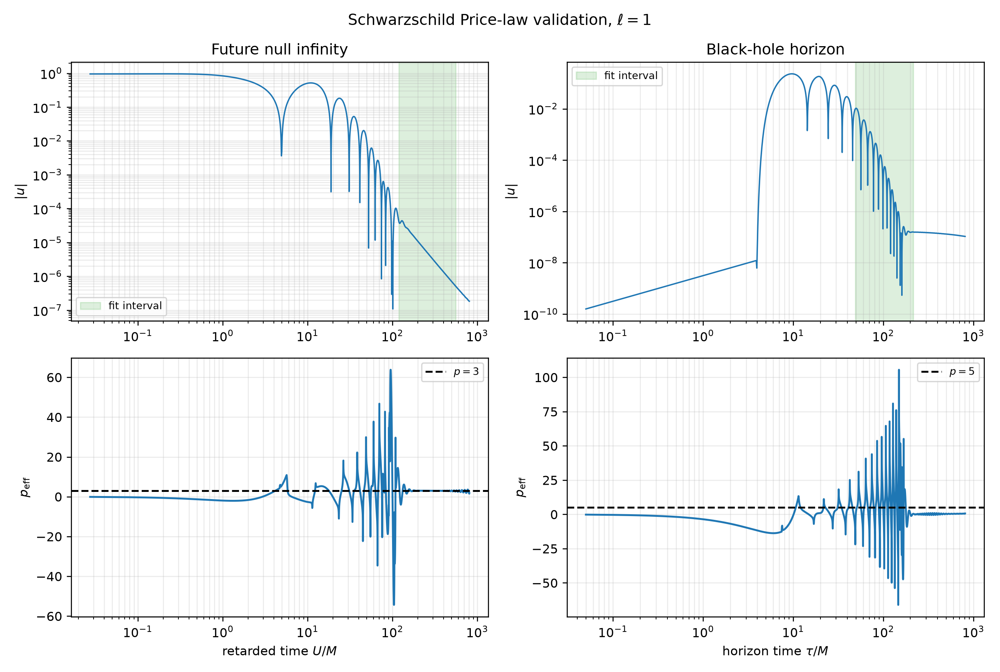
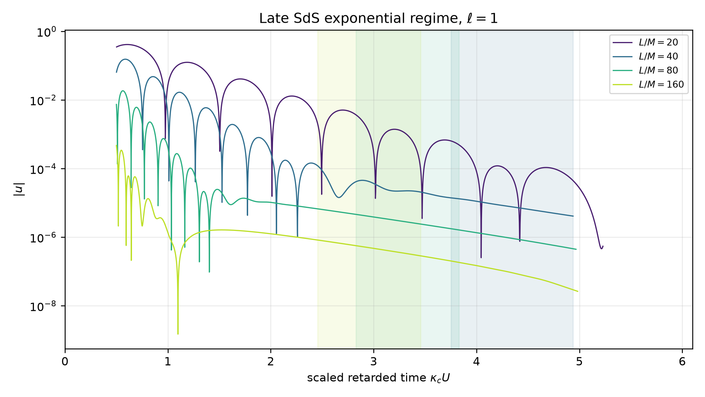
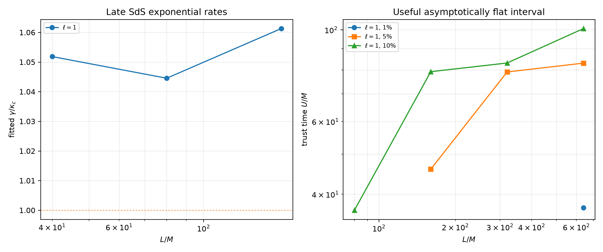
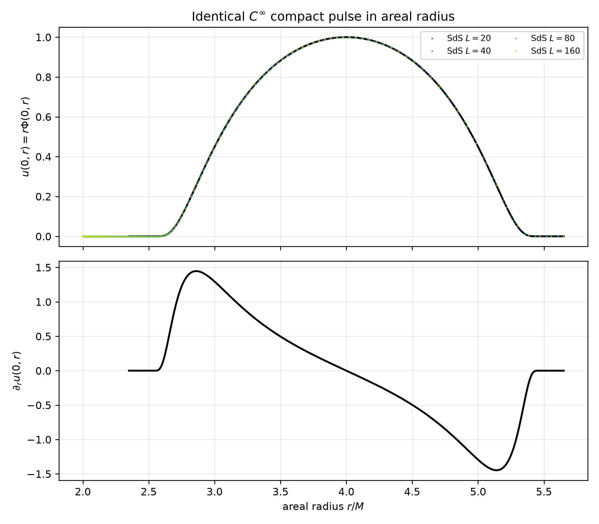
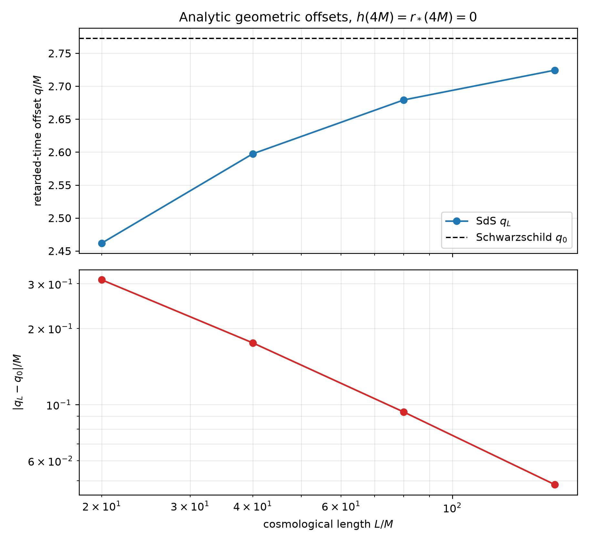
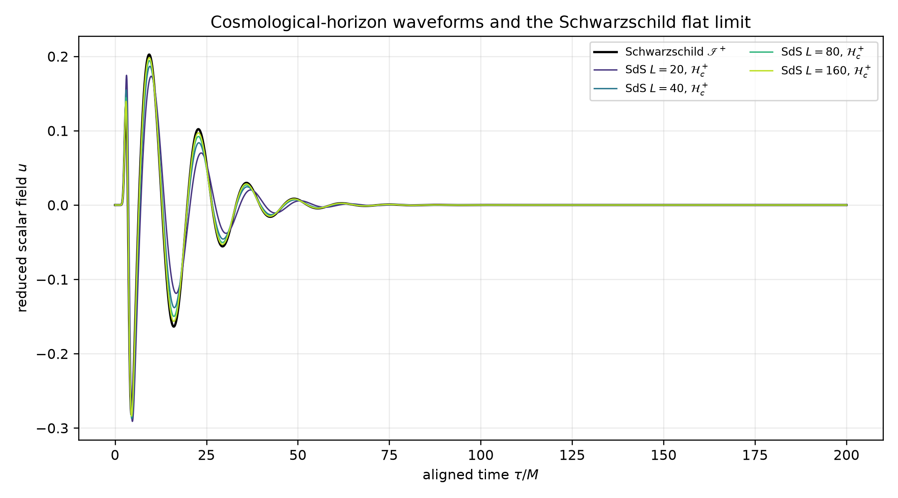
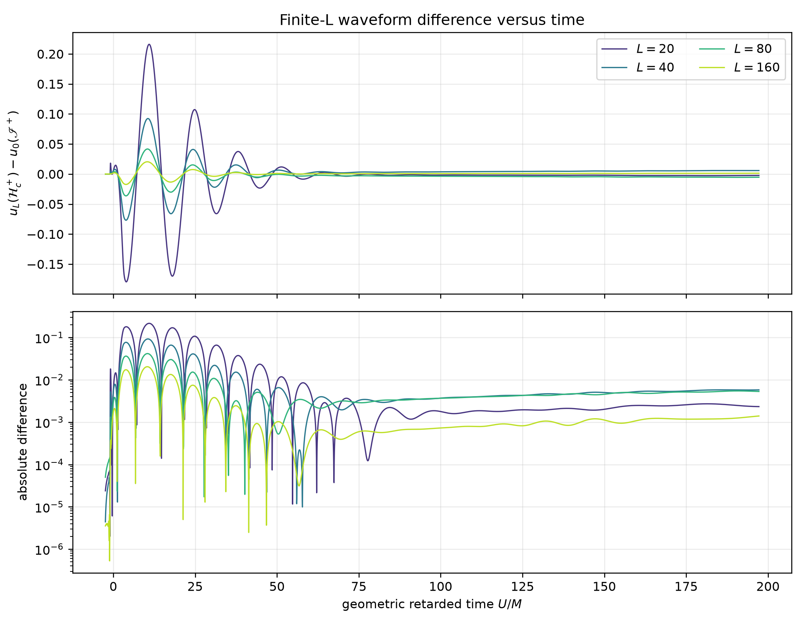
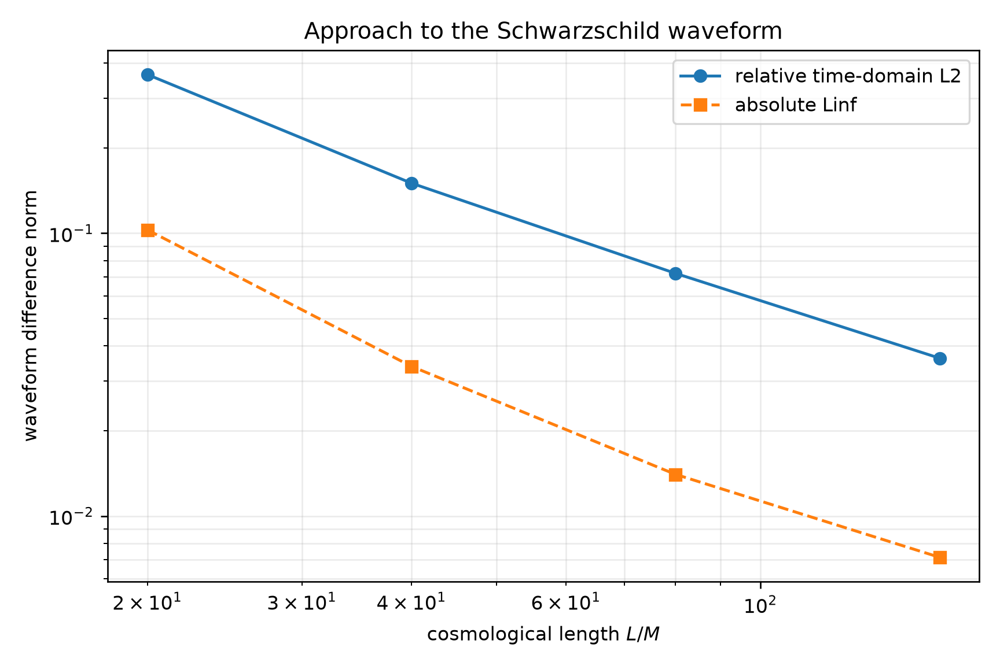
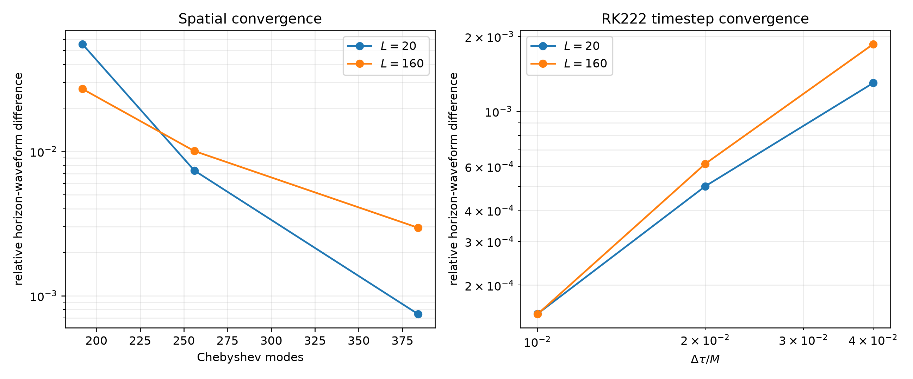

<div align="center">

# Hyperboloidal Black-Hole Wave Evolution

### Schwarzschild perturbations, Schwarzschild-de Sitter bridges, and the asymptotically flat limit

**Govind Arun Kumar**<br>
University of Maryland<br>
Scientific supervision: [Professor Anıl Zenginoğlu](https://anilzen.github.io/)

</div>

---

## Abstract

This repository studies wave propagation on black-hole spacetimes using
hyperboloidal and bridge coordinates. It contains two connected numerical
projects:

1. axial gravitational perturbations of a Schwarzschild black hole, evolved
   with the compactified Regge-Wheeler equation; and
2. a reduced scalar field on Schwarzschild-de Sitter (SdS), evolved between
   the black-hole and cosmological horizons and compared with an independent
   Schwarzschild reference at future null infinity.

The current principal results are a controlled one-dimensional SdS-to-
Schwarzschild flat-limit experiment and a high-resolution tail/crossover
study. The latter uses identical initially dynamical physical data,
validates the Schwarzschild Price exponents `2`, `3`, and `4` at future null
infinity for `ell = 0, 1, 2`, recovers the nonzero finite-`L` SdS monopole,
and resolves exponential dipole and quadrupole regimes. Tail production uses
up to 2048 Chebyshev modes, with explicit resolution, timestep, pulse-width,
and trust-time diagnostics.

> **Reproducibility:** source code, raw simulation archives, CSV tables,
> diagnostics, figures, and convergence runs are stored together in this
> repository.

## Main numerical findings

All quantities below use `M = 1`, scalar harmonic index `ell = 2`, the minimal
gauge, 256 Chebyshev modes, RK222 with `dt = 0.01M`, and final time `200M`.

| `L/M` | Geometric offset `q_L/M` | Relative waveform L2 difference | Maximum absolute difference | Maximum constraint |
|---:|---:|---:|---:|---:|
| 20  | 2.461850 | 0.637800 | 0.215998 | `6.41e-10` |
| 40  | 2.597389 | 0.265234 | 0.092405 | `3.36e-9` |
| 80  | 2.679137 | 0.127435 | 0.041692 | `4.01e-9` |
| 160 | 2.724272 | 0.056625 | 0.020420 | `1.62e-9` |

The Schwarzschild offset is `q_0/M = 4 log(2) = 2.772589`. Both the waveform
difference and `|q_L - q_0|` decrease as `L` increases. This is numerical
evidence for the finite-time flat limit over the tested sequence; it is not
presented as a proof of an asymptotic power law.

## Latest tail and crossover results

The tail study uses initially dynamical data with `u = psi = 0` and the same
physical velocity `G(r)` on every background. The momentum is initialized
separately as `pi = G/A`, so the physical initial velocity—not merely a
coordinate array—is identical across the Schwarzschild and SdS sequence.

The independent Schwarzschild calculation recovers the expected
future-null-infinity Price exponents:

| `ell` | Expected power | Measured power | Fit `R^2` |
|---:|---:|---:|---:|
| 0 | 2 | 2.0251 | 0.999994 |
| 1 | 3 | 2.9842 | 0.999377 |
| 2 | 4 | 4.0293 | 0.999791 |

For finite `L`, the `ell = 0` field approaches a nonzero constant. The
resolved dipole rates are `gamma/kappa_c = 1.0518`, `1.0445`, and `1.0613`
for `L/M = 40`, `80`, and `160`, respectively. The `ell = 2`, `L/M = 80`
case gives `gamma/kappa_c = 1.9249`, close to the predicted value `2`.
Large-`L` dipole runs through `L/M = 640` quantify 1%, 5%, and 10% waveform
trust times; their late exponential rates at fixed `N = 1024` are marked
unresolved after the amplitudes reach spatial-truncation plateaus.



*Schwarzschild dipole validation. The future-null-infinity signal recovers
the expected power `3`; the much smaller horizon tail is conservatively
reported as unresolved.*



*Finite-`L` dipole signals on a semilogarithmic scale. Shaded bands identify
fit intervals that pass the stability and fit-quality requirements.*



*Resolved exponential rates and sliding-window trust times. Missing rate
points at `L/M = 320` and `640` explicitly record the fixed-resolution
conditioning limit.*

The complete derivation, fit intervals, convergence evidence, and limitations
are documented in [the tail-study report](docs/TAILS.md).

## 1. Scientific questions

The computations address the following questions:

- Can black-hole wave equations be evolved directly on domains whose
  boundaries are null horizons or future null infinity?
- Do bridge coordinates provide stable, boundary-condition-free evolution
  between the SdS black-hole and cosmological horizons?
- Does the cosmological-horizon signal approach the Schwarzschild signal at
  future null infinity when the cosmological length `L` tends to infinity?
- Can that comparison be made using identical physical initial data and a
  geometrically defined time coordinate rather than fitted waveform shifts?

## 2. Geometric and numerical formulation

### Background spacetime

For the SdS calculation, the static metric coefficient is

```text
f_L(r) = 1 - 2M/r - r^2/L^2,
Lambda = 3/L^2.
```

The computational coordinate is

```text
rho = (1 - r_b/r) / (1 - r_b/r_c),
```

where `r_b` and `r_c` are the black-hole and cosmological horizon radii.
Consequently, `rho = 0` is the future black-hole horizon and `rho = 1` is the
future cosmological horizon. In the limit `L -> infinity`, this coordinate
approaches the Schwarzschild compactification `rho = 1 - 2M/r`, with
`rho = 1` representing future null infinity.

### Evolved field

After spherical-harmonic decomposition, the reduced scalar variable is
`u = r Phi`. The code evolves a first-order system for `u`, its compact-radial
derivative `psi`, and the momentum variable `pi`. The characteristic geometry
makes both endpoints pure outflow boundaries, so no external boundary
conditions are imposed at either null boundary.

### Analytic horizon treatment

The lapse and height-function factors are individually singular at a horizon,
but the evolved coefficients are regular. Their poles are cancelled
analytically before numerical evaluation. Endpoint values are assigned from
closed-form limits rather than evaluations at displaced points. Tests compare
these exact endpoint expressions with their interior limits.

More complete derivations are available in:

- [SdS scalar formulation](docs/SDS_SCALAR.md)
- [Corrected flat-limit derivation and results](docs/FLAT_LIMIT.md)
- [Dynamical tails and crossover study](docs/TAILS.md)
- [Schwarzschild perturbation method](docs/METHOD.md)

## 3. Controlled flat-limit experiment

### Identical initial data in areal radius

An identical Gaussian in `rho` would not define the same physical pulse because
the map between `rho` and areal radius depends on `L`. The corrected sequence
therefore uses one standard smooth compact bump for `u(r)`:

- center: `r_0 = 4M`;
- support: `2.5M < r < 5.5M`;
- peak amplitude: `u(4M) = 1`;
- momentum: `pi = -B psi`.

In the solver, `psi` is the Chebyshev derivative of the represented common
profile. This is the discrete constraint-consistent realization of
`psi = (du/dr)(dr/d rho)`.



*Figure 1. The same compact pulse is sampled on the Schwarzschild-de Sitter
grids for all four cosmological lengths. The upper panel shows `u`; the lower
panel shows its analytic derivative with respect to areal radius. The colored
samples overlap the common black curve.*

### Geometric retarded time

Both the height function `h` and tortoise coordinate `r_*` are normalized to
zero at `r = 4M`. The time translation at the extraction boundary is then
computed geometrically as

```text
q_L = limit of (h_L + r_*,L) at the cosmological horizon,
U   = tau - q_L.
```

The corresponding Schwarzschild limit is taken at future null infinity. The
logarithmic endpoint terms cancel analytically, so no cross-correlation,
least-squares shift, endpoint offset, or fitted translation enters the
comparison.



*Figure 2. The finite-`L` geometric offsets approach the analytic
Schwarzschild value. The lower panel displays the monotonically decreasing
offset error.*

## 4. Waveform results

The signal for each finite `L` is extracted at the future cosmological horizon.
The Schwarzschild reference is extracted independently at future null
infinity. All curves are plotted against the common geometric retarded time
`U`.



*Figure 3. Geometrically aligned horizon signals. As the cosmological horizon
recedes, the SdS transient and ringdown approach the Schwarzschild waveform at
future null infinity.*



*Figure 4. Signed and absolute differences between each finite-`L` signal and
the Schwarzschild reference. The dominant transient discrepancy decreases
systematically through the sequence.*



*Figure 5. Time-domain L2 and maximum-norm errors versus cosmological length.
Both diagnostics decrease monotonically. The measured powers under doubling
`L` are finite-range observations and are not assumed to define an exact
asymptotic scaling law.*

## 5. Numerical validation

### First-order constraint

The monitored reduction constraint is `psi - d_rho u`. Its maximum norm stays
below `4.1e-9` in every finite-`L` production run and below `7.0e-10` in the
Schwarzschild reference.

### Spatial and temporal convergence

Independent validation studies were performed at the two ends of the sequence,
`L/M = 20` and `160`.

- Spatial refinement: `N = 192, 256, 384, 512`, with `dt = 0.0025M`.
- Timestep refinement: `dt/M = 0.04, 0.02, 0.01, 0.005`, with 512 modes.
- Validation interval: `100M`.

Successive spatial waveform differences decrease from `5.54e-2` to `7.45e-4`
at `L/M = 20`, and from `2.71e-2` to `2.96e-3` at `L/M = 160`. The refined
timestep order is `1.71` at `L/M = 20` and `2.01` at `L/M = 160`; the former is
convergent but not fully within the asymptotic timestep regime.



*Figure 6. Successive horizon-waveform differences for spatial and RK222
timestep refinement. The production choice `N = 256`, `dt = 0.01M` is directly
bracketed by finer calculations.*

The detailed numerical tables are available in
[`results/sds_scalar/flat_limit/convergence`](results/sds_scalar/flat_limit/convergence).

## 6. Interpretation and limitations

The corrected experiment supports the expected finite-time Schwarzschild
limit: the coordinate map, geometric time offset, and evolved horizon waveform
all approach their asymptotically flat counterparts as `L` grows.

The flat-limit sequence alone does **not** establish the joint large-`L`,
late-time limit because SdS decay times grow with `L`. That limitation
motivated the separate tail study now included in this repository, with
longer evolutions through `L/M = 640`, local decay rates, and quantitative
trust times. The remaining fixed-resolution conditioning boundary is recorded
explicitly before any planned 3D extension.

## 7. Reproducing the calculation

### Environment

The project uses Python, Dedalus 3.0.5, NumPy, SciPy, and Matplotlib. Create the
environment from the repository root:

```bash
mamba env create -f environment.yml
mamba activate dedalus3
conda env config vars set OMP_NUM_THREADS=1 NUMEXPR_MAX_THREADS=1
```

### Corrected flat-limit sequence

```bash
python -m black_hole --verbose sds-flat-limit \
  --resolution 256 \
  --timestep 0.01 \
  --end-time 200 \
  --signal-dt 0.05 \
  --snapshot-dt 0.5 \
  --convergence-end-time 100 \
  --output-dir results/sds_scalar/flat_limit
```

This command runs the Schwarzschild reference, the four finite-`L` production
cases, both convergence studies, and all plot/table generation.

### Tests

```bash
python -m unittest discover -s tests -v
```

The current suite contains 28 analytic and model-level tests covering horizon
roots, regular endpoint coefficients, compactification and its inverse,
identical areal-radius data, chain-rule initialization, height normalization,
analytic retarded-time limits, the Schwarzschild flat limit, physically
matched velocity data, robust tail fits, alignment, and trust-time logic.

## 8. Repository organization

```text
black_hole/
  sds_model.py              SdS geometry, bridge coefficients, initial data
  schwarzschild_scalar.py   Independent asymptotically flat reference model
  sds_solver.py             Dedalus first-order scalar evolution
  flat_limit_study.py       Controlled sequence, alignment, diagnostics, plots
  tail_analysis.py          Power/exponential fits and trust-time diagnostics
  tail_study.py             Schwarzschild/SdS tail production workflow
  tail_validation.py        Resolution, timestep, and profile reports
  model.py, solver.py       Regge-Wheeler perturbation calculation

docs/
  FLAT_LIMIT.md             Full corrected flat-limit derivation and results
  TAILS.md                  Dynamical tail derivation, validation, and results
  SDS_SCALAR.md             Bridge-coordinate scalar formulation
  METHOD.md                 Schwarzschild perturbation method
  RESULTS.md                Regge-Wheeler production results

results/sds_scalar/flat_limit/
  raw/                      Reproducible production NPZ archives
  convergence/              L/M = 20 and 160 validation runs
  *.csv                     Waveforms, offsets, profiles, and summary tables
  *.png                     Publication-style figures
  diagnostics.json          Machine-readable configuration and diagnostics

results/sds_scalar/tails/
  raw/                      Tail production archives for ell = 0, 1, 2
  convergence/              Resolution and timestep evidence
  profile_sensitivity/      Independent physical-width check
  extension_ell1/           Selected L/M = 320, 640 conditioning study
  ell0/, ell1/, ell2/       Publication-style validation figures
  *.csv, diagnostics.json   Fits, trust times, and complete metadata

tests/                      Analytic and numerical-model regression tests
environment.yml             Reproducible software environment
```

## 9. Data products

The most useful machine-readable outputs are:

- [flat-limit summary](results/sds_scalar/flat_limit/flat_limit_summary.csv)
- [aligned waveform data](results/sds_scalar/flat_limit/waveform_differences.csv)
- [retarded-time offsets](results/sds_scalar/flat_limit/retarded_time_offsets.csv)
- [initial profile](results/sds_scalar/flat_limit/initial_profiles.csv)
- [complete diagnostics](results/sds_scalar/flat_limit/diagnostics.json)
- [raw production archives](results/sds_scalar/flat_limit/raw)
- [tail-study diagnostics](results/sds_scalar/tails/diagnostics.json)
- [Schwarzschild Price-law table](results/sds_scalar/tails/schwarzschild_price_law.csv)
- [SdS decay-rate table](results/sds_scalar/tails/sds_tail_summary.csv)
- [large-`L` trust times](results/sds_scalar/tails/extension_ell1/trust_times.csv)

## Acknowledgments

This project is carried out under the scientific supervision of
[Professor Anıl Zenginoğlu](https://anilzen.github.io/). The bridge-coordinate
construction and emphasis on geometric time normalization follow discussions
and guidance provided during this research project.

## References

1. [A. Zenginoğlu, *Bridging time across null horizons*](https://arxiv.org/abs/2502.08581)
2. [A. Zenginoğlu, *Misner hyperboloidal coordinates*](https://anilzen.github.io/post/2023/misner-hyperboloidal/)
3. [A. Zenginoğlu, *Banging a black hole*](https://anilzen.github.io/post/2026/black-hole-gravitational-waves/)
4. [Dedalus v3 documentation](https://dedalus-project.readthedocs.io/en/latest/)
5. [Published Schwarzschild quasinormal-mode data](https://pages.jh.edu/eberti2/ringdown/)
