<div align="center">

# Hyperboloidal Black-Hole Wave Evolution

### Schwarzschild perturbations, Schwarzschild-de Sitter bridges, and the asymptotically flat limit

**Govind Arun Kumar**<br>
University of Maryland<br>
Scientific supervision: [Professor Anıl Zenginoğlu](https://anilzen.github.io/)

</div>

---

## Abstract

This repository studies wave propagation on black-hole spacetimes using
hyperboloidal and bridge coordinates. It contains two connected numerical
projects:

1. axial gravitational perturbations of a Schwarzschild black hole, evolved
   with the compactified Regge-Wheeler equation; and
2. a reduced scalar field on Schwarzschild-de Sitter (SdS), evolved between
   the black-hole and cosmological horizons and compared with an independent
   Schwarzschild reference at future null infinity.

The current principal results are a controlled one-dimensional SdS-to-
Schwarzschild flat-limit experiment, a high-resolution tail/crossover study,
and the first pure-mode 3D validation. The tail study uses identical initially
dynamical physical data,
validates the Schwarzschild Price exponents `2`, `3`, and `4` at future null
infinity, resolves their finite-radius counterparts, and tracks the
finite-`L` transition from a Schwarzschild power tail to an SdS exponential
tail. The newest exact-observer runs use up to 4096 Chebyshev modes, with
explicit spatial-refinement, timestep, pulse-width, and trust-time
diagnostics. That transition is now quantified as an interval between a
departure from the Schwarzschild reference and an entry into the cosmological
rate, with systematic ranges and finite-radius convergence evidence.

The new angular-spectral calculation evolves pure real `Y_00`, `Y_11`, and
`Y_22` packets on Schwarzschild and `L/M = 80` SdS using an independent
eighth-order radial finite-difference code. It reproduces the 1D waveforms to
relative `L2` errors between `2.0e-6` and `3.4e-5`, recovers the finite-radius
Price indices, matches the dipole and quadrupole transition intervals, and
limits angular contamination to roundoff.

The newest stage replaces pure-mode data by a genuinely three-dimensional
**localized source** modelling the retarded Green function. On Schwarzschild
it reproduces the direct signal and the caustic echo train, with arrival
times, crossing interval, and caustic amplification matching photon-sphere
geometric optics without a fitted parameter. The same physical emitter on
`L/M = 20, 40, 80, 160` converges to the asymptotically flat Green function
like `M/L`, and reaches the expected cosmological end state: a frozen
monopole proportional to `Lambda` and a dipole rate `gamma/kappa_c -> 1`.
The sourced equations now have both the production eighth-order
finite-difference backend and an optional Chebyshev--Dedalus 3 backend with
stage-accurate Killing-time forcing and archive-compatible modal outputs.

> **Reproducibility:** source code, raw simulation archives, CSV tables,
> diagnostics, figures, and convergence runs are stored together in this
> repository.

## Main numerical findings

All quantities below use `M = 1`, scalar harmonic index `ell = 2`, the minimal
gauge, 256 Chebyshev modes, RK222 with `dt = 0.01M`, and final time `200M`.

| `L/M` | Geometric offset `q_L/M` | Relative waveform L2 difference | Maximum absolute difference | Maximum constraint |
|---:|---:|---:|---:|---:|
| 20  | 2.461850 | 0.637800 | 0.215998 | `6.41e-10` |
| 40  | 2.597389 | 0.265234 | 0.092405 | `3.36e-9` |
| 80  | 2.679137 | 0.127435 | 0.041692 | `4.01e-9` |
| 160 | 2.724272 | 0.056625 | 0.020420 | `1.62e-9` |

The Schwarzschild offset is `q_0/M = 4 log(2) = 2.772589`. Both the waveform
difference and `|q_L - q_0|` decrease as `L` increases. This is numerical
evidence for the finite-time flat limit over the tested sequence; it is not
presented as a proof of an asymptotic power law.

## Latest tail and crossover results

The tail study uses initially dynamical data with `u = psi = 0` and the same
physical velocity `G(r)` on every background. The momentum is initialized
separately as `pi = G/A`, so the physical initial velocity—not merely a
coordinate array—is identical across the Schwarzschild and SdS sequence.

The independent Schwarzschild calculation recovers the expected
future-null-infinity Price exponents:

| `ell` | Expected power | Measured power | Fit `R^2` |
|---:|---:|---:|---:|
| 0 | 2 | 2.0251 | 0.999994 |
| 1 | 3 | 2.9842 | 0.999377 |
| 2 | 4 | 4.0293 | 0.999791 |

The refined finite-radius Schwarzschild runs use `N = 2048` for
`ell = 0,1` and `N = 4096` for `ell = 2`, with exact Dedalus interpolation
operators at `r/M = 4,8,16,20,50,100,200`. At `r = 20M`, the clean late
rates are approximately `-2.93`, `-4.74`, and `-6.71`, approaching the
finite-radius targets `-3`, `-5`, and `-7`; the corresponding future-null-
infinity rates approach `-2`, `-3`, and `-4`.

For finite `L`, a centered RMS amplitude envelope removes phase singularities
at waveform zero crossings before the local exponential rate is
differentiated.

## Final crossover result

The crossover is now reported as a **transition interval** in `kappa_c U`,
bracketed by a persistent departure from an independently evolved
Schwarzschild reference and a persistent entry into a tolerance of the
cosmological rate `gamma/kappa_c = ell`, with a systematic range obtained by
sweeping 54 estimator and criterion settings. Dipole values at `r = 8M`:

| `L/M` | departure `kappa_c U` | entry `kappa_c U` | departure `U/M` | entry `U/M` | resolved |
|---:|---|---|---:|---:|---:|
| 20 | unresolved | unresolved | -- | -- | 0/54 |
| 40 | 2.73 | 4.27 | 115.1 | 180.3 | 1/54 |
| 80 | 1.41 [1.15, 1.76] | 2.83 [2.56, 3.07] | 115.9 | 232.7 | 54/54 |
| 160 | 0.82 [0.71, 0.96] | 2.94 [2.68, 3.19] | 133.5 | 476.9 | 54/54 |

The two well-resolved entry times agree to `4%` in cosmological units while
differing by a factor `2.05` in geometric units, so the approach to the
cosmological rate is governed by `kappa_c^{-1}`. The departure instead stays
near `120M` for both lengths, so it is governed by `M`; the transition
interval therefore widens with `L`. The `L/M = 20` case is reported as
unresolved: its rate stays near `2.1` and never enters a band around `1`.

Spatial convergence at `r = 8M` is demonstrated with matched-timestep ladders
and a halved-timestep control, and the Schwarzschild reference run shows that
its own Price-law plateau at `r = 8M` only begins at `U ~ 220M`, later than
the departures above. The complete final report is
[`docs/CROSSOVER.md`](docs/CROSSOVER.md).

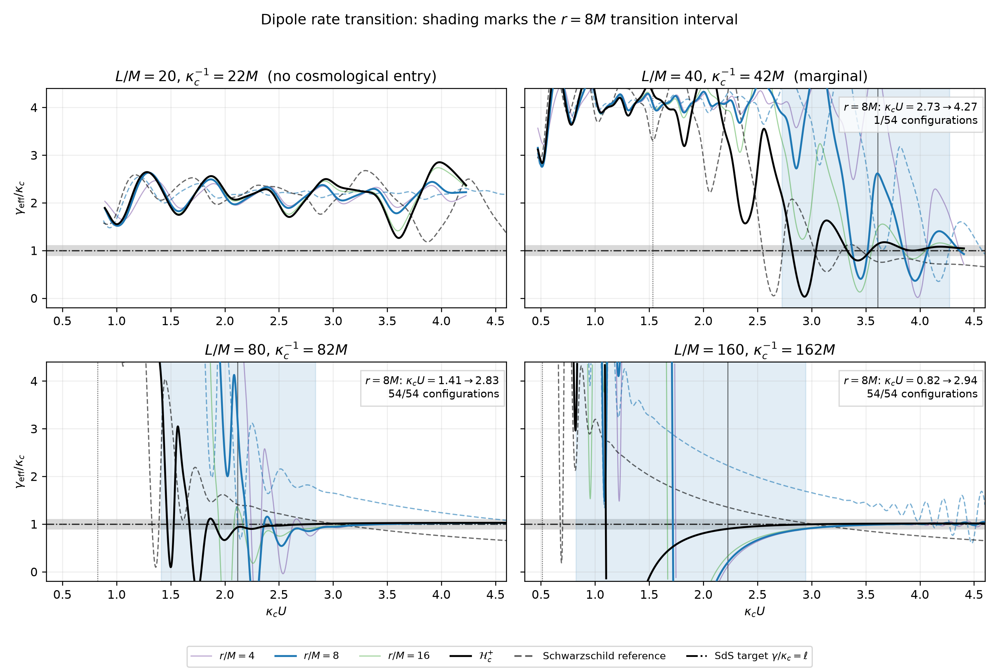

*Local dipole rates against the primary time variable `kappa_c U`, with the
Schwarzschild reference at the same observer (dashed) and the `r = 8M`
transition interval shaded.*

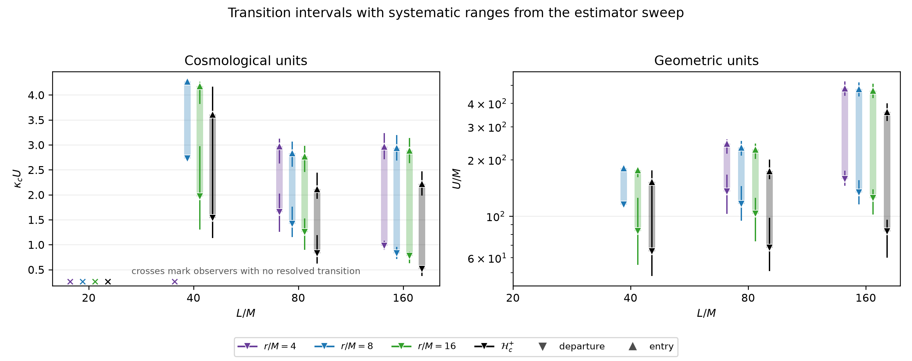

*Departure-to-entry bars with the full sweep range. Crosses mark observers
with no resolved transition.*

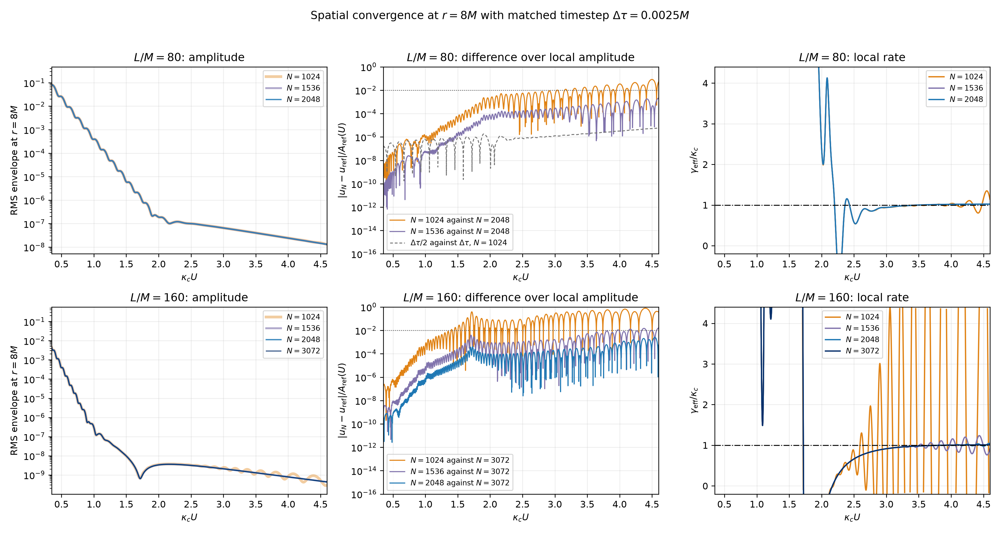

*Matched-timestep spatial convergence at `r = 8M`, with errors measured
against the local tail amplitude.*

## First 3D pure-mode validation

The requested pure-angular-data stage is complete. The 3D field is represented
in orthonormal real spherical harmonics and evolved with a radial
discretization independent of the 1D Dedalus implementation. The production
modes are `(ell,m) = (0,0), (1,1), (2,2)` on Schwarzschild and `L/M = 80`
SdS.

| result | 3D | 1D |
|---|---:|---:|
| Schwarzschild `ell=0` index at `r=8M` | 3.0006 | 3.0006 |
| Schwarzschild `ell=1` index at `r=8M` | 4.9506 | 4.9553 |
| Schwarzschild `ell=2` index at `r=8M` | 6.9518 | 6.9185 |
| dipole entry `kappa_c U` | 2.833 | 2.835 |
| quadrupole entry `kappa_c U` | 3.554 | 3.546 |

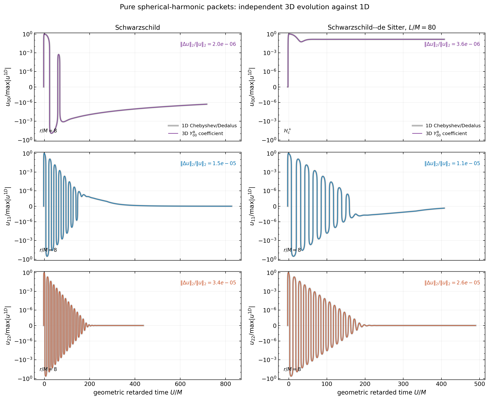

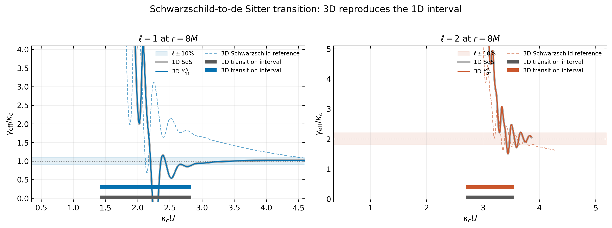

The formulation, convergence ladders, constraints, angular-mode purity,
limitations, and reproduction commands are in
[`docs/THREE_D_VALIDATION.md`](docs/THREE_D_VALIDATION.md). Mixed angular data
remain the next stage; they are not conflated with this pure-mode benchmark.

## Retarded Green function: caustic echoes and the mixed-mode SdS flat limit

The requested next stage is complete: the pure spherical-harmonic data are
replaced by a genuinely three-dimensional **localized source** that models the
retarded Green function. Starting from zero data we solve `Box Phi = S` with a
smooth emitter at `r = 6M` in the equatorial plane, specified once in the
background-independent labels `(t, r, theta, phi)` and evaluated on each
background at `t = tau - h_L(r)`. The same physical emitter therefore acts on
Schwarzschild and on `L/M = 20, 40, 80, 160`.

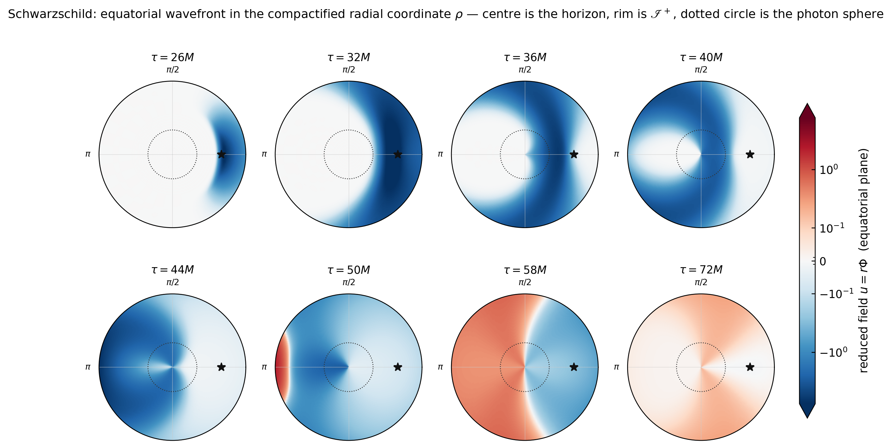

*The pulse leaves the emitter (star), wraps the photon sphere in both
directions, and refocuses on the far side of the black hole. Drawn in the
computational radial coordinate: centre is the horizon, rim is future null
infinity.*

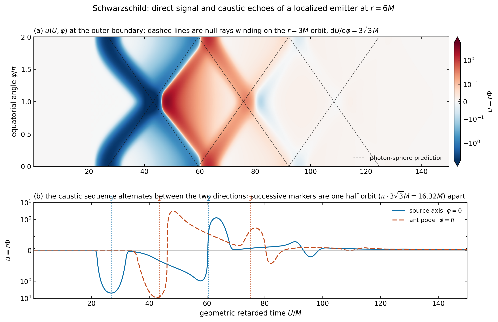

*The waveform at future null infinity against retarded time and equatorial
angle. The dashed lines are not fits: they are the arrival times of null rays
winding on the `r = 3M` photon orbit.*

Three parameter-free checks on the Schwarzschild caustic sequence:

| quantity | measured | geometric optics | difference |
|---|---:|---:|---:|
| direct arrival `U/M` | 26.85 | 26.614 | `0.9%` |
| crossing interval `dU/M` | 16.147 | 16.324 | `1.1%` |
| first caustic / direct signal | 1.872 | amplification | — |

The first caustic echo is **larger than the direct signal** even after
travelling half way around the black hole. The envelope then falls by a
factor `0.214` per crossing.

The flat limit of the mixed-mode Green function, measured on
`U = tau - q_L` over the window `[5M, 115M]`:

| `L/M` | `q_L/M` | relative `L2` | relative `Linf` | max constraint |
|---:|---:|---:|---:|---:|
| 20  | 2.461850 | 1.1067 | 0.7890 | `2.72e-9` |
| 40  | 2.597389 | 0.5199 | 0.3456 | `1.76e-9` |
| 80  | 2.679137 | 0.2529 | 0.1598 | `6.81e-10` |
| 160 | 2.724272 | 0.1249 | 0.0767 | `5.18e-10` |

Both norms halve at each doubling of `L`; the fitted exponent is `-1.05`,
that is, `M/L` convergence to the asymptotically flat Green function.

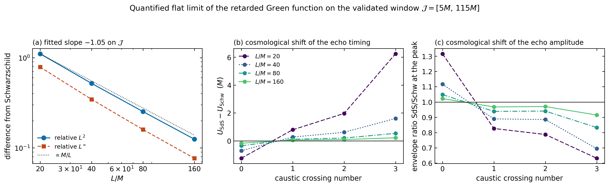

The cosmological end state is the expected one. The monopole freezes onto a
constant proportional to `Lambda` (`Phi L^2/M^2 = -99.1, -94.2, -91.9, -90.8`),
and the dipole rate approaches `gamma/kappa_c = 1` at every length.

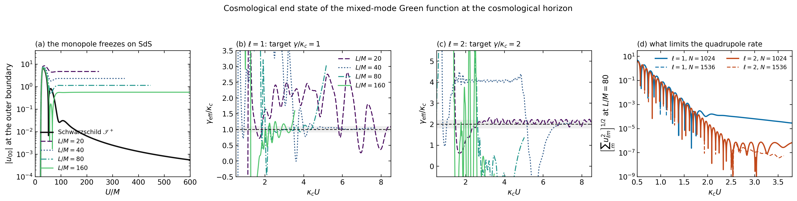

The source term is verified against an **independent static-coordinate
leapfrog solve** that shares no part of the hyperboloidal machinery — no
height function, no compactification, no first-order reduction — and the two
agree to `1e-5` to `5e-4` relative, with the residual falling as the
reference is refined.

Full formulation, suite definition, refinement ladders, the sharpened-emitter
follow-up, and an explicit list of what is *not* established are in
[`docs/GREEN_FUNCTION.md`](docs/GREEN_FUNCTION.md).

## Earlier high-resolution rate figures

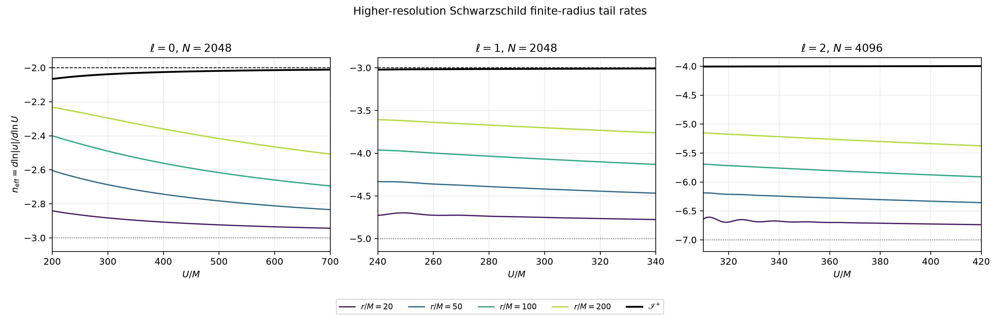

*Higher-resolution local power indices at four finite radii and future null
infinity. The restricted vertical ranges expose the approach to the
location-dependent Price rates.*

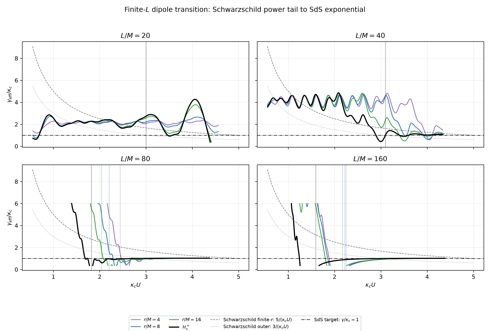

*Phase-insensitive local dipole rates at three finite radii and the
cosmological horizon, compared with the Schwarzschild power-law and SdS
exponential predictions.*

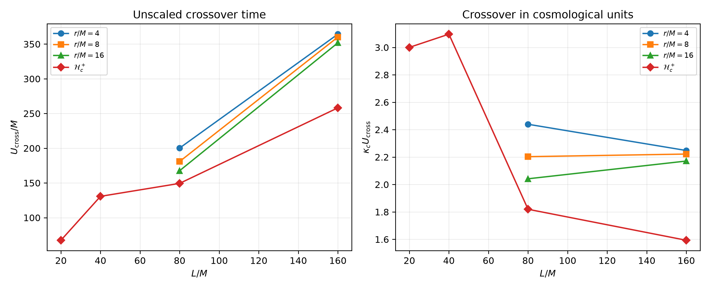

*Operational crossover times in physical and cosmological units. Missing
finite-radius points mean that no persistent transition was resolved; they
are not silently extrapolated.*

The [quadrupole refinement plot](results/sds_scalar/tails/high_resolution_rates/sds_ell2_L80_rate_refinement.png)
provides the independent higher-multipole check.

The complete derivation, fit intervals, convergence evidence, and limitations
are documented in [the tail-study report](docs/TAILS.md), and the final
crossover criterion, its systematic ranges, and the finite-radius convergence
evidence are in [the crossover report](docs/CROSSOVER.md).

## 1. Scientific questions

The computations address the following questions:

- Can black-hole wave equations be evolved directly on domains whose
  boundaries are null horizons or future null infinity?
- Do bridge coordinates provide stable, boundary-condition-free evolution
  between the SdS black-hole and cosmological horizons?
- Does the cosmological-horizon signal approach the Schwarzschild signal at
  future null infinity when the cosmological length `L` tends to infinity?
- Can that comparison be made using identical physical initial data and a
  geometrically defined time coordinate rather than fitted waveform shifts?
- Does a 3D angular-spectral evolution of pure `Y_lm` data reproduce the
  corresponding 1D waveforms, rates, transition intervals, constraints, and
  convergence behavior without generating spurious angular modes?

## 2. Geometric and numerical formulation

### Background spacetime

For the SdS calculation, the static metric coefficient is

```text
f_L(r) = 1 - 2M/r - r^2/L^2,
Lambda = 3/L^2.
```

The computational coordinate is

```text
rho = (1 - r_b/r) / (1 - r_b/r_c),
```

where `r_b` and `r_c` are the black-hole and cosmological horizon radii.
Consequently, `rho = 0` is the future black-hole horizon and `rho = 1` is the
future cosmological horizon. In the limit `L -> infinity`, this coordinate
approaches the Schwarzschild compactification `rho = 1 - 2M/r`, with
`rho = 1` representing future null infinity.

### Evolved field

After spherical-harmonic decomposition, the reduced scalar variable is
`u = r Phi`. The code evolves a first-order system for `u`, its compact-radial
derivative `psi`, and the momentum variable `pi`. The characteristic geometry
makes both endpoints pure outflow boundaries, so no external boundary
conditions are imposed at either null boundary.

### Analytic horizon treatment

The lapse and height-function factors are individually singular at a horizon,
but the evolved coefficients are regular. Their poles are cancelled
analytically before numerical evaluation. Endpoint values are assigned from
closed-form limits rather than evaluations at displaced points. Tests compare
these exact endpoint expressions with their interior limits.

More complete derivations are available in:

- [SdS scalar formulation](docs/SDS_SCALAR.md)
- [Corrected flat-limit derivation and results](docs/FLAT_LIMIT.md)
- [Dynamical tails and crossover study](docs/TAILS.md)
- [Final crossover report with uncertainties](docs/CROSSOVER.md)
- [Schwarzschild perturbation method](docs/METHOD.md)

## 3. Controlled flat-limit experiment

### Identical initial data in areal radius

An identical Gaussian in `rho` would not define the same physical pulse because
the map between `rho` and areal radius depends on `L`. The corrected sequence
therefore uses one standard smooth compact bump for `u(r)`:

- center: `r_0 = 4M`;
- support: `2.5M < r < 5.5M`;
- peak amplitude: `u(4M) = 1`;
- momentum: `pi = -B psi`.

In the solver, `psi` is the Chebyshev derivative of the represented common
profile. This is the discrete constraint-consistent realization of
`psi = (du/dr)(dr/d rho)`.

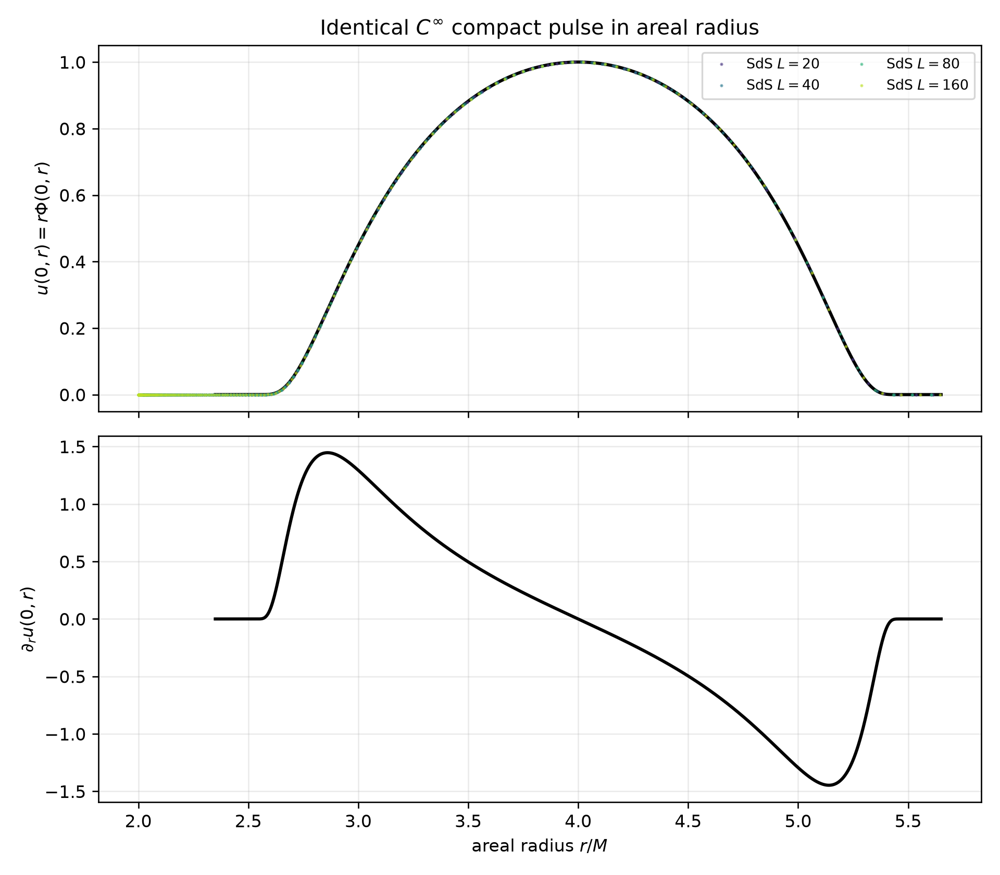

*Figure 1. The same compact pulse is sampled on the Schwarzschild-de Sitter
grids for all four cosmological lengths. The upper panel shows `u`; the lower
panel shows its analytic derivative with respect to areal radius. The colored
samples overlap the common black curve.*

### Geometric retarded time

Both the height function `h` and tortoise coordinate `r_*` are normalized to
zero at `r = 4M`. The time translation at the extraction boundary is then
computed geometrically as

```text
q_L = limit of (h_L + r_*,L) at the cosmological horizon,
U   = tau - q_L.
```

The corresponding Schwarzschild limit is taken at future null infinity. The
logarithmic endpoint terms cancel analytically, so no cross-correlation,
least-squares shift, endpoint offset, or fitted translation enters the
comparison.

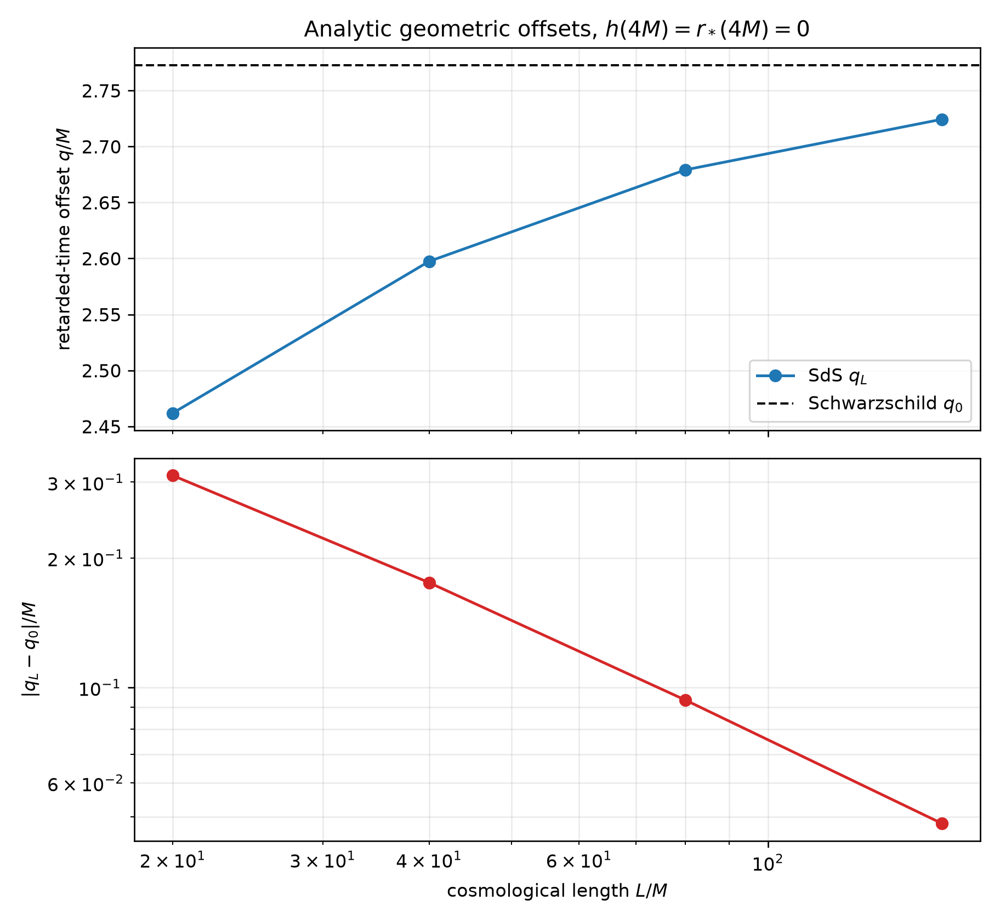

*Figure 2. The finite-`L` geometric offsets approach the analytic
Schwarzschild value. The lower panel displays the monotonically decreasing
offset error.*

## 4. Waveform results

The signal for each finite `L` is extracted at the future cosmological horizon.
The Schwarzschild reference is extracted independently at future null
infinity. All curves are plotted against the common geometric retarded time
`U`.

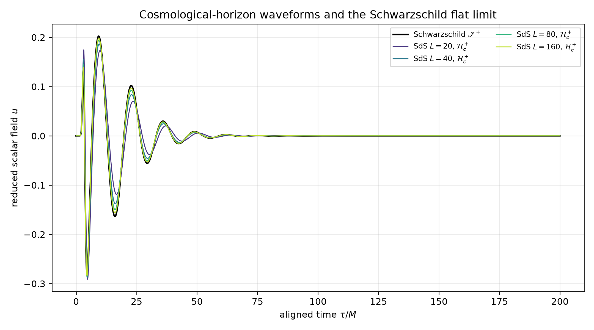

*Figure 3. Geometrically aligned horizon signals. As the cosmological horizon
recedes, the SdS transient and ringdown approach the Schwarzschild waveform at
future null infinity.*

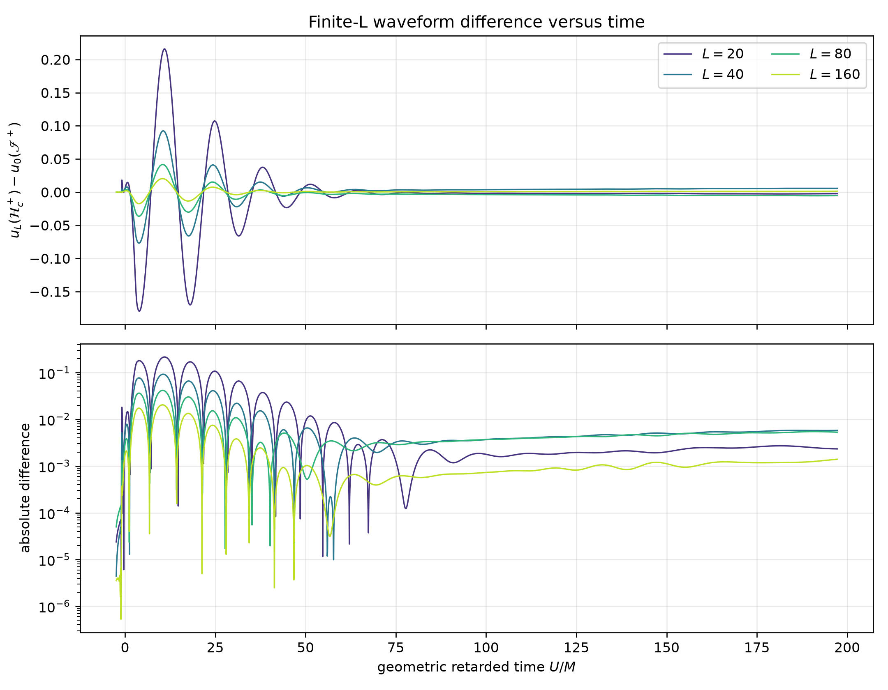

*Figure 4. Signed and absolute differences between each finite-`L` signal and
the Schwarzschild reference. The dominant transient discrepancy decreases
systematically through the sequence.*

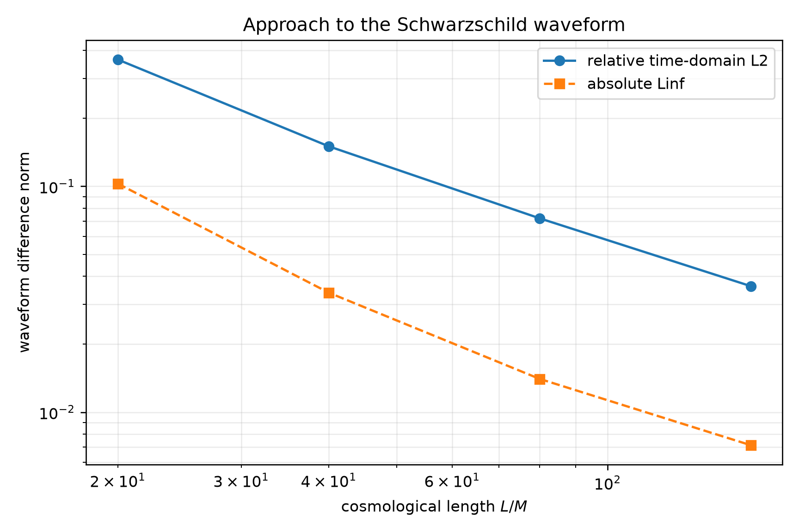

*Figure 5. Time-domain L2 and maximum-norm errors versus cosmological length.
Both diagnostics decrease monotonically. The measured powers under doubling
`L` are finite-range observations and are not assumed to define an exact
asymptotic scaling law.*

## 5. Numerical validation

### First-order constraint

The monitored reduction constraint is `psi - d_rho u`. Its maximum norm stays
below `4.1e-9` in every finite-`L` production run and below `7.0e-10` in the
Schwarzschild reference.

### Spatial and temporal convergence

Independent validation studies were performed at the two ends of the sequence,
`L/M = 20` and `160`.

- Spatial refinement: `N = 192, 256, 384, 512`, with `dt = 0.0025M`.
- Timestep refinement: `dt/M = 0.04, 0.02, 0.01, 0.005`, with 512 modes.
- Validation interval: `100M`.

Successive spatial waveform differences decrease from `5.54e-2` to `7.45e-4`
at `L/M = 20`, and from `2.71e-2` to `2.96e-3` at `L/M = 160`. The refined
timestep order is `1.71` at `L/M = 20` and `2.01` at `L/M = 160`; the former is
convergent but not fully within the asymptotic timestep regime.

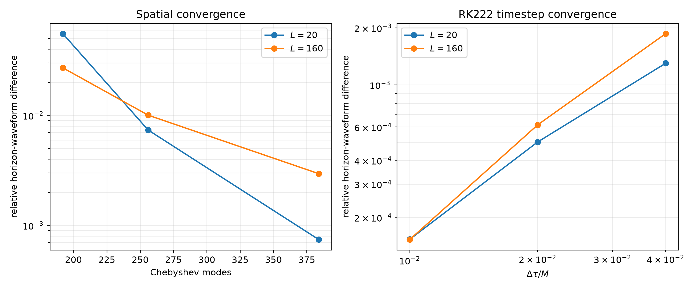

*Figure 6. Successive horizon-waveform differences for spatial and RK222
timestep refinement. The production choice `N = 256`, `dt = 0.01M` is directly
bracketed by finer calculations.*

The detailed numerical tables are available in
[`results/sds_scalar/flat_limit/convergence`](results/sds_scalar/flat_limit/convergence).

## 6. Interpretation and limitations

The corrected experiment supports the expected finite-time Schwarzschild
limit: the coordinate map, geometric time offset, and evolved horizon waveform
all approach their asymptotically flat counterparts as `L` grows.

The flat-limit sequence alone does **not** establish the joint large-`L`,
late-time limit because SdS decay times grow with `L`. That limitation
motivated the separate tail study now included in this repository, with
longer evolutions through `L/M = 640`, local decay rates, and quantitative
trust times. The remaining fixed-resolution conditioning boundary is recorded
explicitly. The pure-mode 3D extension is reported separately, so it does not
alter the scope of the one-dimensional flat-limit claim.

## 7. Reproducing the calculation

### Environment

The project uses Python, Dedalus 3.0.5, NumPy, SciPy, and Matplotlib. Create the
environment from the repository root:

```bash
mamba env create -f environment.yml
mamba activate dedalus3
conda env config vars set OMP_NUM_THREADS=1 NUMEXPR_MAX_THREADS=1
```

### Corrected flat-limit sequence

```bash
python -m black_hole --verbose sds-flat-limit \
  --resolution 256 \
  --timestep 0.01 \
  --end-time 200 \
  --signal-dt 0.05 \
  --snapshot-dt 0.5 \
  --convergence-end-time 100 \
  --output-dir results/sds_scalar/flat_limit
```

This command runs the Schwarzschild reference, the four finite-`L` production
cases, both convergence studies, and all plot/table generation.

### Final crossover analysis

```bash
python -m black_hole.crossover_final \
  --output-dir results/sds_scalar/tails/crossover_final
```

This reads the archived exact-observer evolutions and regenerates the
transition intervals, the estimator sweep, the convergence tables, and every
figure of [`docs/CROSSOVER.md`](docs/CROSSOVER.md). The evolution commands
that produce those archives are listed in the same report.

### Pure-mode 3D validation

```bash
python -m black_hole.three_d_validation --verbose suite \
  --output-dir results/three_d_validation
```

This runs the six production evolutions, twelve matched-timestep radial
refinements, and all waveform, rate, transition, constraint, convergence, and
angular-purity analysis. To regenerate only the figures and tables:

```bash
python -m black_hole.three_d_validation analyze \
  --output-dir results/three_d_validation
```

### Localized-source Green-function study

```bash
python -m black_hole green-function-run --output-dir results/green_function
python -m black_hole green-function-report --output-dir results/green_function

# Run the same sourced equations with Chebyshev--Dedalus fields.
python -m black_hole green-function-run \
  --backend dedalus \
  --output-dir results/green_function \
  schwarzschild
```

The first command runs every evolution of the suite: the Schwarzschild and
four SdS production cases, the radial, timestep, angular, and stencil
ladders, and the sharpened emitter. Individual cases can be named, which
parallelizes well across cores; running the module with no arguments lists
them. Dedalus archives are kept separately under
`results/green_function/dedalus`, so they cannot overwrite the published
finite-difference suite. The report command rebuilds every figure and table
from the production archives alone and needs no Dedalus installation.

### Tests

```bash
python -m unittest discover -s tests -v
```

The test suite covers horizon roots, regular endpoint coefficients,
compactification and its inverse,
identical areal-radius data, chain-rule initialization, height normalization,
analytic retarded-time limits, the Schwarzschild flat limit, physically
matched velocity data, robust tail fits, alignment, trust-time logic, the
envelope rate estimator, the transition-interval criterion, real
spherical-harmonic transforms, eighth-order radial operators, and a short
pure-mode 3D evolution. In the pinned Dedalus environment it also runs
localized-source activation and finite-difference/Dedalus agreement tests.

## 8. Repository organization

```text
black_hole/
  sds_model.py              SdS geometry, bridge coefficients, initial data
  schwarzschild_scalar.py   Independent asymptotically flat reference model
  sds_solver.py             Dedalus first-order scalar evolution
  flat_limit_study.py       Controlled sequence, alignment, diagnostics, plots
  tail_analysis.py          Power/exponential fits and trust-time diagnostics
  high_resolution_tail_rates.py  Exact-observer refinement and crossover report
  crossover_final.py        Transition intervals, sweeps, and convergence report
  three_d_solver.py          Angular-spectral pure-mode 3D evolution
  three_d_validation.py      3D/1D comparisons, convergence, plots, and tables
  localized_source.py        Localized emitter and its exact angular spectrum
  source_evolution.py        Sourced mixed-mode 3D evolution on Schwarzschild/SdS
  dedalus_source_evolution.py  Chebyshev--Dedalus sourced-evolution backend
  static_reference.py        Independent static-coordinate check of the source
  caustic_study.py           Green-function suite, ladders, and echo analysis
  caustic_report.py          Green-function figures, tables, and JSON digest
  sds_result.py             Saved-evolution container shared by solver and analysis
  tail_study.py             Schwarzschild/SdS tail production workflow
  tail_validation.py        Resolution, timestep, and profile reports
  model.py, solver.py       Regge-Wheeler perturbation calculation

docs/
  FLAT_LIMIT.md             Full corrected flat-limit derivation and results
  TAILS.md                  Dynamical tail derivation, validation, and results
  CROSSOVER.md              Final transition-interval report and uncertainties
  THREE_D_VALIDATION.md     Pure-mode 3D formulation and validation results
  GREEN_FUNCTION.md         Localized-source caustic echoes and SdS flat limit
  SDS_SCALAR.md             Bridge-coordinate scalar formulation
  METHOD.md                 Schwarzschild perturbation method
  RESULTS.md                Regge-Wheeler production results

results/sds_scalar/flat_limit/
  raw/                      Reproducible production NPZ archives
  convergence/              L/M = 20 and 160 validation runs
  *.csv                     Waveforms, offsets, profiles, and summary tables
  *.png                     Publication-style figures
  diagnostics.json          Machine-readable configuration and diagnostics

results/sds_scalar/tails/
  raw/                      Tail production archives for ell = 0, 1, 2
  convergence/              Resolution and timestep evidence
  profile_sensitivity/      Independent physical-width check
  extension_ell1/           Selected L/M = 320, 640 conditioning study
  high_resolution_rates/    Exact-observer archives, rate tables, and figures
  crossover_final/          Final transition intervals, sweeps, and convergence
  ell0/, ell1/, ell2/       Publication-style validation figures
  *.csv, diagnostics.json   Fits, trust times, and complete metadata

results/three_d_validation/
  raw/                      Six production 3D archives
  convergence/raw/          Twelve matched-timestep radial refinements
  *.csv                     Waveform, rate, transition, and convergence tables
  *.png                     3D/1D and angular-purity figures
  diagnostics.json          Full configurations and derived diagnostics

results/green_function/
  raw/                      Schwarzschild and four SdS sourced archives
  convergence/raw/          Radial, timestep, angular, and stencil ladders
  narrow/raw/               Sharpened-emitter follow-up
  tables/*.csv              Modes, echoes, flat limit, late time, convergence
  *.png                     Caustic, flat-limit, and validation figures
  green_function_summary.json  Every derived number in one machine-readable file
  dedalus/                  Optional same-schema Dedalus cross-check archives

tests/                      Analytic and numerical-model regression tests
environment.yml             Reproducible software environment
```

## 9. Data products

The most useful machine-readable outputs are:

- [flat-limit summary](results/sds_scalar/flat_limit/flat_limit_summary.csv)
- [aligned waveform data](results/sds_scalar/flat_limit/waveform_differences.csv)
- [retarded-time offsets](results/sds_scalar/flat_limit/retarded_time_offsets.csv)
- [initial profile](results/sds_scalar/flat_limit/initial_profiles.csv)
- [complete diagnostics](results/sds_scalar/flat_limit/diagnostics.json)
- [transition intervals](results/sds_scalar/tails/crossover_final/transition_intervals.csv)
- [per-setting transition sweep](results/sds_scalar/tails/crossover_final/transition_sweep.csv)
- [finite-radius convergence](results/sds_scalar/tails/crossover_final/sds_ell1_r8_convergence.csv)
- [Schwarzschild power-law onset](results/sds_scalar/tails/crossover_final/schwarzschild_power_law_onset.csv)
- [raw production archives](results/sds_scalar/flat_limit/raw)
- [tail-study diagnostics](results/sds_scalar/tails/diagnostics.json)
- [Schwarzschild Price-law table](results/sds_scalar/tails/schwarzschild_price_law.csv)
- [SdS decay-rate table](results/sds_scalar/tails/sds_tail_summary.csv)
- [large-`L` trust times](results/sds_scalar/tails/extension_ell1/trust_times.csv)
- [3D/1D waveform agreement](results/three_d_validation/waveform_agreement.csv)
- [3D/1D transition intervals](results/three_d_validation/transition_intervals.csv)
- [3D radial convergence](results/three_d_validation/radial_convergence.csv)
- [complete 3D diagnostics](results/three_d_validation/diagnostics.json)
- [caustic pulse measurements](results/green_function/tables/caustic_pulses.csv)
- [caustic phase relations](results/green_function/tables/caustic_phase.csv)
- [SdS Green-function flat limit](results/green_function/tables/sds_flat_limit.csv)
- [caustic timing shift with `L`](results/green_function/tables/sds_pulse_timing.csv)
- [source-term cross-validation](results/green_function/tables/source_validation.csv)
- [Green-function convergence ladders](results/green_function/tables/convergence.csv)
- [complete Green-function digest](results/green_function/green_function_summary.json)

## Acknowledgments

This project is carried out under the scientific supervision of
[Professor Anıl Zenginoğlu](https://anilzen.github.io/). The bridge-coordinate
construction and emphasis on geometric time normalization follow discussions
and guidance provided during this research project.

## References

1. [A. Zenginoğlu, *Bridging time across null horizons*](https://arxiv.org/abs/2502.08581)
2. [A. Zenginoğlu, *Misner hyperboloidal coordinates*](https://anilzen.github.io/post/2023/misner-hyperboloidal/)
3. [A. Zenginoğlu, *Banging a black hole*](https://anilzen.github.io/post/2026/black-hole-gravitational-waves/)
4. [Dedalus v3 documentation](https://dedalus-project.readthedocs.io/en/latest/)
5. [Published Schwarzschild quasinormal-mode data](https://pages.jh.edu/eberti2/ringdown/)
