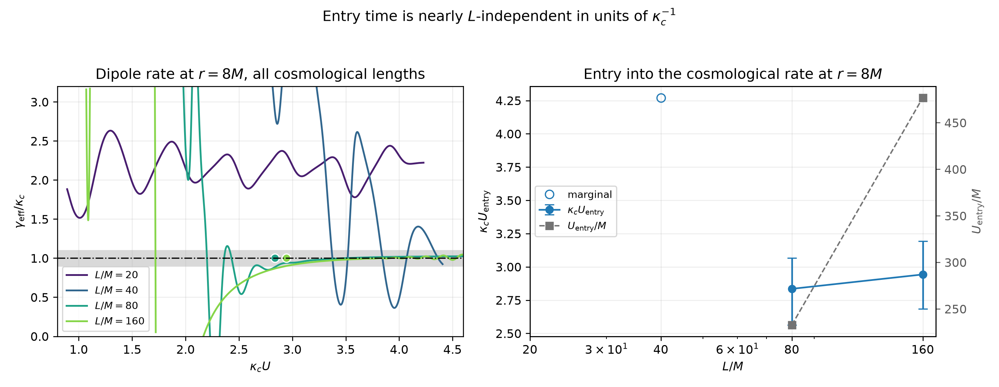
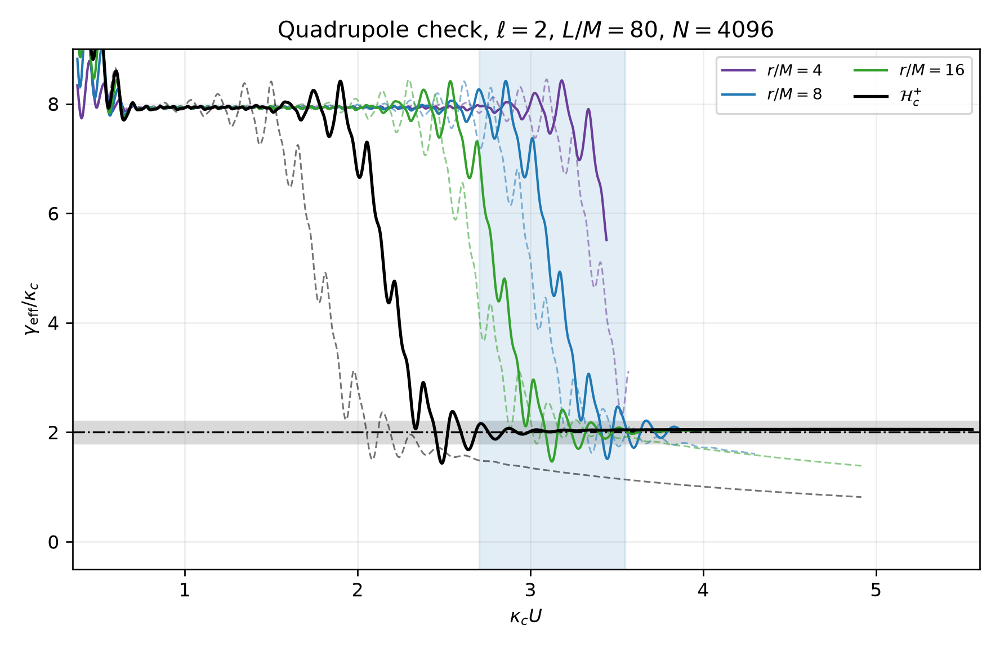

# Final crossover report: from the Schwarzschild tail to the de Sitter tail

This report closes the one-dimensional tail study.  It replaces the earlier
"closer to" crossover classification with a **transition interval**, quotes
**systematic ranges** instead of single high-precision times, demonstrates
**spatial convergence at a finite radius**, and uses \(\kappa_c U\) as the
primary time variable throughout.

All quantities use \(M=1\), the minimal gauge, `RK222`, and the identical
physical initial velocity of the tail study: \(u=\psi=0\) at \(\tau=0\) and
\(\partial_\tau u=G(r)\) with \(G\) a smooth bump centered at \(r=6M\) supported
on \(3M<r<9M\), realized as \(\pi_L=G/A_L\) on every background.

Everything below is produced by
[`black_hole/crossover_final.py`](../black_hole/crossover_final.py) and stored
in [`results/sds_scalar/tails/crossover_final`](../results/sds_scalar/tails/crossover_final).

## 1. What changed relative to the previous pass

| Item | Previous | This report |
|---|---|---|
| Crossover definition | first sustained interval *closer to* \(\ell\) than to \(p/(\kappa_cU)\) | departure from Schwarzschild **and** entry into a tolerance of \(\ell\), reported as an interval |
| Schwarzschild comparison | analytic \(p/(\kappa_cU)\) only | the local rate measured in an independent Schwarzschild evolution at the same observer, with identical physical data |
| Uncertainty | one number to four digits | median and full range over 54 estimator and criterion settings |
| Unresolved cases | a crossing time was still printed | reported as `no_cosmological_entry`, with the measured late rate shown |
| Convergence | outer-boundary comparison at \(N=1024\) vs \(N=2048\) | \(r=8M\) ladders at matched \(\Delta\tau\), plus a halved-timestep control |
| Time variable | \(U/M\), with \(\kappa_cU\) secondary | \(\kappa_cU\) primary, \(U/M\) secondary |

## 2. Definitions

### Local rate

The waveform crosses zero during ringing, so \(\mathrm{d}\ln|u|/\mathrm{d}U\)
is singular at every crossing.  The rate is therefore taken from a centered
root-mean-square envelope \(A\) of width \(w_{\rm rms}\), smoothed by a
cubic Savitzky-Golay filter of width \(w\):

\[
\gamma_{\rm eff}(U)=-\frac{\mathrm{d}\ln A}{\mathrm{d}U},
\qquad
A(U)=\Big[\big\langle u^2\big\rangle_{w_{\rm rms}}\Big]^{1/2}.
\]

Samples whose envelope has reached the double-precision amplitude floor, and
samples inside the filter half-widths, are discarded rather than plotted.

The normalized rate is \(\gamma_{\rm eff}/\kappa_c\).  Its cosmological target
for a minimally coupled field with \(\ell>0\) is \(\ell\); the Schwarzschild
Price value is \(p=\ell+2\) at future null infinity and \(p=2\ell+3\) at fixed
areal radius, which in these variables is the *decaying* curve
\(p/(\kappa_cU)\), not a constant.

### Reference

For each finite \(L\) and each observer, the reference is the local rate of a
**separate Schwarzschild evolution** with the same physical initial velocity,
read at the same areal radius, with the same resolution, timestep, and
retarded-time normalization.  The SdS cosmological horizon is compared with
Schwarzschild future null infinity, which is the correspondence established by
the earlier flat-limit study.  The reference run was extended to
\(U\approx827M\) so that it covers every finite-\(L\) evolution in full.

### Transition interval

With \(x=\kappa_cU\), \(y=\gamma_{\rm eff}/\kappa_c\), reference \(y_0\),
tolerance \(\varepsilon\), and persistence width \(\delta\):

* **Entry** \(x_{\rm ent}\): the start of the first interval of width
  \(\delta\) on which \(|y-\ell|\le\varepsilon\,\ell\), provided the same
  tolerance also holds over at least 80 percent of the remaining resolved
  samples.  A transient visit to the band is rejected.
* **Departure** \(x_{\rm dep}\): the end of the **last** interval of width
  \(\delta\) before \(x_{\rm ent}\) on which
  \(|y-y_0|\le\varepsilon\max(|y_0|,\ell)\).  Searching backwards from the
  entry means that an isolated mismatch during the ringdown-to-tail dip, after
  which the two solutions agree again, does not count as the departure.

A case is `resolved` only if both exist.  Otherwise it is reported as
`no_cosmological_entry` (the rate never settles onto \(\ell\)) or
`no_schwarzschild_agreement` (no persistent agreement with the reference
precedes the entry), and no crossover time is quoted.  Cases resolved by fewer
than half of the swept settings are labeled `marginal`.

Samples with \(U<30M\) are excluded at every \(L\), because the pulse itself
is supported on \(3M<r<9M\); the cut is physical, not proportional to
\(\kappa_c^{-1}\).

## 3. Systematic sweep

The two times are recomputed for every combination of

| Parameter | Values |
|---|---|
| Savitzky-Golay width \(w\) | \(20M\), \(30M\), \(45M\) |
| envelope fraction \(w_{\rm rms}/w\) | \(0.4\), \(0.6\) |
| persistence \(\delta\) | \(0.15\), \(0.25\), \(0.40\) in \(\kappa_cU\) |
| tolerance \(\varepsilon\) | \(0.05\), \(0.10\), \(0.20\) |

which is 54 settings per observer.  Tables report the median and the full
range over the settings that resolve the transition, together with how many of
the 54 did.  Raw per-setting values are in
[`transition_sweep.csv`](../results/sds_scalar/tails/crossover_final/transition_sweep.csv).

## 4. Dipole transition intervals

\(\ell=1\), \(N=2048\), \(\Delta\tau=0.0025M\).  Times are medians with the
full sweep range in brackets.

| \(L/M\) | Observer | Status | resolved | \(\kappa_cU_{\rm dep}\) | \(\kappa_cU_{\rm ent}\) | \(U_{\rm dep}/M\) | \(U_{\rm ent}/M\) |
|---:|---|---|---:|---|---|---:|---:|
| 20 | \(r=4,8,16M\), \(\mathcal H_c^+\) | no cosmological entry | 0/54 | -- | -- | -- | -- |
| 40 | \(r=4M\) | no cosmological entry | 0/54 | -- | -- | -- | -- |
| 40 | \(r=8M\) | marginal | 1/54 | 2.73 | 4.27 | 115.1 | 180.3 |
| 40 | \(r=16M\) | marginal | 18/54 | 1.97 [1.30, 2.97] | 4.18 [3.82, 4.27] | 83.1 | 176.4 |
| 40 | \(\mathcal H_c^+\) | resolved | 27/54 | 1.53 [1.13, 3.89] | 3.61 [3.31, 4.16] | 64.7 | 152.4 |
| 80 | \(r=4M\) | resolved | 54/54 | 1.65 [1.25, 2.03] | 2.98 [2.63, 3.13] | 135.4 | 244.2 |
| 80 | \(r=8M\) | resolved | 54/54 | 1.41 [1.15, 1.76] | 2.83 [2.56, 3.07] | 115.9 | 232.7 |
| 80 | \(r=16M\) | resolved | 54/54 | 1.25 [0.89, 1.53] | 2.77 [2.46, 2.98] | 102.7 | 227.3 |
| 80 | \(\mathcal H_c^+\) | resolved | 35/54 | 0.83 [0.62, 1.19] | 2.12 [1.92, 2.44] | 67.8 | 173.9 |
| 160 | \(r=4M\) | resolved | 45/54 | 0.97 [0.90, 1.08] | 2.97 [2.71, 3.23] | 157.7 | 481.0 |
| 160 | \(r=8M\) | resolved | 54/54 | 0.82 [0.71, 0.96] | 2.94 [2.68, 3.19] | 133.5 | 476.9 |
| 160 | \(r=16M\) | resolved | 54/54 | 0.77 [0.63, 0.86] | 2.89 [2.63, 3.14] | 124.7 | 468.4 |
| 160 | \(\mathcal H_c^+\) | marginal | 25/54 | 0.51 [0.37, 0.59] | 2.22 [1.99, 2.47] | 82.7 | 360.3 |

Machine-readable:
[`transition_intervals.csv`](../results/sds_scalar/tails/crossover_final/transition_intervals.csv).


*Local rates against \(\kappa_cU\).  Solid: finite \(L\).  Dashed: the
Schwarzschild reference at the same observer.  The band marks
\(\ell\pm10\%\); the shaded column is the \(r=8M\) transition interval.*


*Each bar runs from departure to entry.  Whiskers are the full sweep range;
crosses mark observers with no resolved transition.*

### The \(L/M=20\) case

The advisor's suspicion is confirmed.  At every observer the \(L/M=20\)
dipole rate oscillates around \(\gamma_{\rm eff}/\kappa_c\approx2.1\) for the
whole evolution and never enters a \(20\%\) band around \(1\); none of the 54
settings resolves a transition.  The earlier horizon value
\(\kappa_cU=3.00\) was the point where the two reference curves cross, not a
point where the measured rate is close to the cosmological rate.  The physical
reason is the absence of scale separation: \(\kappa_c^{-1}=22.5M\) is
comparable with the ringdown and with any usable envelope width, so this
background has no interval in which either regime is separately identifiable.

## 5. Scaling: \(\kappa_cU\) is the right variable for entry



At \(r=8M\):

| \(L/M\) | \(\kappa_cU_{\rm ent}\) | \(U_{\rm ent}/M\) | \(\kappa_cU_{\rm dep}\) | \(U_{\rm dep}/M\) |
|---:|---|---:|---|---:|
| 80 | 2.83 [2.56, 3.07] | 232.7 | 1.41 [1.15, 1.76] | 115.9 |
| 160 | 2.94 [2.68, 3.19] | 476.9 | 0.82 [0.71, 0.96] | 133.5 |

The entry times agree to \(4\%\) in cosmological units while differing by a
factor \(2.05\) in geometric units, and the two sweep ranges overlap over most
of their width.  This is the effect the advisor pointed to in the earlier
numbers \(2.203\) and \(2.222\); the stricter criterion moves both values up
to \(\approx2.9\), because entry now requires the rate to be *inside* a
tolerance of \(\ell\) rather than merely closer to \(\ell\) than to the power
law, and the agreement survives.

The departure behaves oppositely: \(115.9M\) and \(133.5M\) are close in
geometric units and differ by a factor \(1.7\) in cosmological units.  So the
finite-\(L\) waveform stops following Schwarzschild at a time set by \(M\),
whereas it settles onto the cosmological rate at a time set by
\(\kappa_c^{-1}\).  The transition interval therefore widens with \(L\): at
\(r=8M\) it spans \(117M\) for \(L/M=80\) and \(343M\) for \(L/M=160\).

Two lengths determine the departure trend only weakly; taken at face value,
the growth is roughly logarithmic in \(L\) (about \(18M\) per doubling at
\(r=8M\)).  This is an observation from two points, not a fitted law.

## 6. Is there a Schwarzschild power-law window at all?

The Schwarzschild reference run answers this directly.  Measuring when its own
local index \(\gamma_{\rm eff}U\) first settles within \(5\%\) of the Price
value and stays there for \(150M\):

| \(\ell\) | \(r=4M\) | \(r=8M\) | \(r=16M\) | \(\mathscr I^+\) |
|---:|---:|---:|---:|---:|
| 1 (\(p=2\ell+3=5\); \(p=3\) at \(\mathscr I^+\)) | \(232.5M\) | \(220.3M\) | \(222.5M\) | \(167.3M\) |
| 2 (\(p=7\); \(p=4\) at \(\mathscr I^+\)) | not attained | \(304.1M\) | \(291.2M\) | \(195.0M\) |

Compare with the departures above: at \(r=8M\) the \(L/M=80\) and \(L/M=160\)
solutions leave the Schwarzschild waveform at \(116M\) and \(134M\), both
*before* the Schwarzschild power law itself sets in at \(220M\).  The same
holds at the horizon (\(68M\) and \(83M\) against \(167M\)).

The consequence is stated plainly: for \(L/M\le160\) and this initial data,
these evolutions do **not** contain a clean Price-law plateau followed by a
cosmological tail.  They contain a ringdown-to-tail transient that agrees with
Schwarzschild, a departure from it, and then the exponential cosmological
tail.  Recovering a genuine intermediate power-law window at a finite radius
requires a considerably larger \(L\); extrapolating the two measured
departures logarithmically suggests \(L/M\) of order \(10^3\), which is a
recommendation for the next run rather than a result of this one.

This is consistent with the waveform-based trust times of the previous pass
(\(10\%\) trust at \(36.6M\) for \(L/M=80\) and \(79.2M\) for \(L/M=160\) at
the horizon): the amplitude comparison departs slightly earlier than the rate
comparison, as expected from a more sensitive diagnostic.

## 7. Quadrupole check

\(\ell=2\), \(L/M=80\), \(N=4096\), \(\Delta\tau=0.00125M\):

| Observer | Status | resolved | \(\kappa_cU_{\rm dep}\) | \(\kappa_cU_{\rm ent}\) | late \(\gamma_{\rm eff}/\kappa_c\) |
|---|---|---:|---|---|---:|
| \(r=4M\) | no cosmological entry | 0/54 | -- | -- | 7.27 (floor limited) |
| \(r=8M\) | marginal | 16/54 | 2.70 [2.39, 2.87] | 3.55 [3.48, 3.66] | 2.03 |
| \(r=16M\) | resolved | 54/54 | 2.22 [1.02, 2.55] | 3.33 [3.15, 3.46] | 2.04 |
| \(\mathcal H_c^+\) | resolved | 52/54 | 1.40 [0.61, 1.62] | 2.66 [2.51, 2.88] | 2.05 |



The late rate reaches the predicted \(\gamma/\kappa_c=\ell=2\) to within
\(2.5\%\), and every entry time is later than the corresponding dipole entry,
so the approach to the cosmological rate is slower for higher \(\ell\) in
cosmological units as well.  The \(r=4M\) quadrupole signal reaches the
spatial-truncation floor before settling and is reported as unresolved.

## 8. Finite-radius convergence at \(r=8M\)

Requested check: exact-observer runs, matched timestep, at least two
resolutions, for \(L/M=80\) and \(160\).  All runs below use
\(\Delta\tau=0.0025M\) and record the observers with exact Dedalus
interpolation operators.  Errors are quoted **relative to the local amplitude**
\(A(U)\), because the tail at \(r=8M\) falls to \(\sim10^{-9}\) of the peak,
where an error that is negligible relative to the peak is not negligible
relative to the signal.

### \(L/M=80\), reference \(N=2048\)

| \(N\) | \(\max|u_N-u_{\rm ref}|/A\) | median | \(\kappa_cU_{\rm dep}\) | \(\kappa_cU_{\rm ent}\) | status | \(\max\|C\|_\infty\) |
|---:|---:|---:|---:|---:|---|---:|
| 1024 | \(3.4\times10^{-2}\) | \(8.9\times10^{-4}\) | 1.550 | 2.799 | resolved 27/54 | \(1.8\times10^{-9}\) |
| 1536 | \(9.6\times10^{-4}\) | \(5.1\times10^{-5}\) | 1.412 | 2.835 | resolved 54/54 | \(1.5\times10^{-9}\) |
| 2048 | reference | -- | 1.412 | 2.835 | resolved 54/54 | \(6.9\times10^{-9}\) |

### \(L/M=160\), reference \(N=3072\)

| \(N\) | \(\max|u_N-u_{\rm ref}|/A\) | median | \(\kappa_cU_{\rm dep}\) | \(\kappa_cU_{\rm ent}\) | status | \(\max\|C\|_\infty\) |
|---:|---:|---:|---:|---:|---|---:|
| 1024 | \(5.8\times10^{-1}\) | \(4.2\times10^{-2}\) | -- | -- | no cosmological entry | \(8.7\times10^{-10}\) |
| 1536 | \(1.1\times10^{-2}\) | \(3.8\times10^{-4}\) | 0.934 | 2.690 | marginal 21/54 | \(1.7\times10^{-9}\) |
| 2048 | \(8.3\times10^{-4}\) | \(4.0\times10^{-5}\) | 0.824 | 2.943 | resolved 54/54 | \(2.7\times10^{-9}\) |
| 3072 | reference | -- | 0.824 | 2.942 | resolved 54/54 | \(7.0\times10^{-9}\) |

Both ladders converge spectrally, and the transition times stop moving once the
local error drops below about \(10^{-3}\): the two finest runs agree to
\(0.001\) in \(\kappa_cU\) at \(L/M=160\) and to the printed digits at
\(L/M=80\).  The reported \(N=2048\) values are therefore converged in space.

The same table at the cosmological horizon, in
[`sds_ell1_r8_convergence.csv`](../results/sds_scalar/tails/crossover_final/sds_ell1_r8_convergence.csv),
shows that \(r=8M\) is the demanding observer: at \(L/M=160\) the horizon error
at \(N=1024\) is \(1.8\times10^{-1}\) while the \(r=8M\) error is
\(5.8\times10^{-1}\), because the \(r=8M\) tail is about three orders of
magnitude weaker.  This is the direct justification for the request: a
resolution that looks adequate at the outer boundary is not adequate at a
finite radius.


*Left: RMS envelope at \(r=8M\), drawn thick-to-thin with resolution.  Center:
difference to the finest run divided by the local amplitude, with the halved
timestep for comparison; the dotted line is \(1\%\).  Right: local rates.*

### Timestep control

A ladder at fixed \(\Delta\tau\) only measures spatial error if the shared
timestep contributes less.  Repeating \(L/M=80\), \(N=1024\) with
\(\Delta\tau=0.00125M\) changes the \(r=8M\) signal by

| comparison | maximum, relative to local amplitude | median |
|---|---:|---:|
| \(\Delta\tau/2\) against \(\Delta\tau\) at \(N=1024\) | \(3.2\times10^{-6}\) | \(8.3\times10^{-7}\) |
| \(N=1024\) against \(N=2048\) at fixed \(\Delta\tau\) | \(3.4\times10^{-2}\) | \(8.9\times10^{-4}\) |

so the temporal error is four orders of magnitude below the spatial error at
the same resolution.  The ladders above measure spatial convergence.

## 9. Uncertainty budget

For the headline \(r=8M\) entry times:

| Source | \(L/M=80\) | \(L/M=160\) |
|---|---|---|
| estimator and criterion sweep (54 settings) | \(+0.23/-0.27\) | \(+0.25/-0.26\) |
| spatial discretization (two finest resolutions) | \(<0.001\) | \(0.001\) |
| timestep (halved \(\Delta\tau\)) | negligible | negligible |
| **quoted value** | \(\kappa_cU_{\rm ent}=2.83^{+0.23}_{-0.27}\) | \(\kappa_cU_{\rm ent}=2.94^{+0.25}_{-0.26}\) |

The uncertainty is entirely systematic in the estimator, not numerical.  The
difference between the two lengths, \(0.11\), is a fifth of that systematic, so
the two entry times are consistent with a single \(L\)-independent value
\(\kappa_cU_{\rm ent}\approx2.9\) at \(r=8M\).  The corresponding departure
times are \(\kappa_cU_{\rm dep}=1.41^{+0.35}_{-0.26}\) and
\(0.82^{+0.13}_{-0.11}\), which are *not* consistent with each other in
cosmological units, but are consistent in geometric units
(\(116M\) and \(134M\)).

## 10. Limitations

* Two cosmological lengths carry the convergence evidence; \(L/M=320\) and
  \(640\) are not included here because the archived runs for those lengths
  use \(N=1024\), which this study shows is insufficient at \(r=8M\) for
  \(L/M=160\) already.
* The departure depends on comparing with a Schwarzschild evolution, so it
  inherits that run's own resolution.  Its rate at \(r=8M\) is clean over the
  whole comparison window, but the comparison is not meaningful after the
  Schwarzschild signal reaches its amplitude floor.  The dipole reference
  covers every dipole case in full (\(U\le827M\)); the quadrupole reference
  ends at \(U=437M\) against a \(490M\) evolution, which is after every
  measured \(\ell=2\) departure but not after every entry.
* The \(\ell=0\) case is excluded: the minimally coupled monopole approaches a
  nonzero constant, so a decay-rate crossover is not defined for it.  Its
  constant-approach evidence is in [`TAILS.md`](TAILS.md).
* Statuses reflect this initial-data family.  A wider or narrower pulse shifts
  the ringdown-to-tail transient, and with it the departure; the earlier
  profile-sensitivity study covers that variation for the rates but not for
  the transition interval.

## 11. Reproduction

```bash
# evolutions (Dedalus)
python -m black_hole.high_resolution_tail_rates run --background schwarzschild \
    --ell 1 --resolution 2048 --timestep 0.0025 --end-time 830 \
    --output-dir results/sds_scalar/tails/crossover_final/raw
python -m black_hole.high_resolution_tail_rates run --background sds --ell 1 \
    --length 80 --resolution 1024 --timestep 0.0025 --end-time 410.4952471239025 \
    --output-dir results/sds_scalar/tails/crossover_final/raw
# ... likewise N=1536 for L=80, and N=1024,1536,3072 for L=160
python -m black_hole.high_resolution_tail_rates run --background sds --ell 1 \
    --length 80 --resolution 1024 --timestep 0.00125 --end-time 410.4952471239025 \
    --output-dir results/sds_scalar/tails/crossover_final/raw_timestep

# analysis, figures, and tables
python -m black_hole.crossover_final \
    --output-dir results/sds_scalar/tails/crossover_final
```

The criterion itself is covered by
[`tests/test_crossover_final.py`](../tests/test_crossover_final.py), which
checks that a synthetic power-to-exponential crossover is bracketed on both
sides, that a transient visit to the target band is rejected, and that a pure
power law is reported as unresolved.
