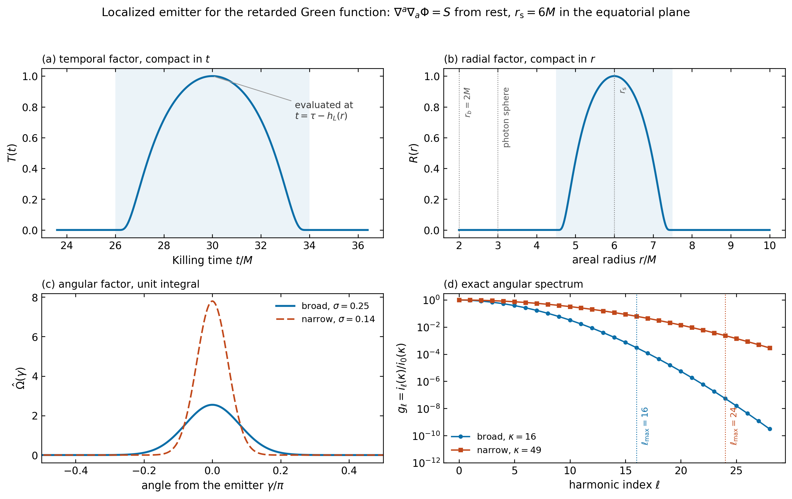
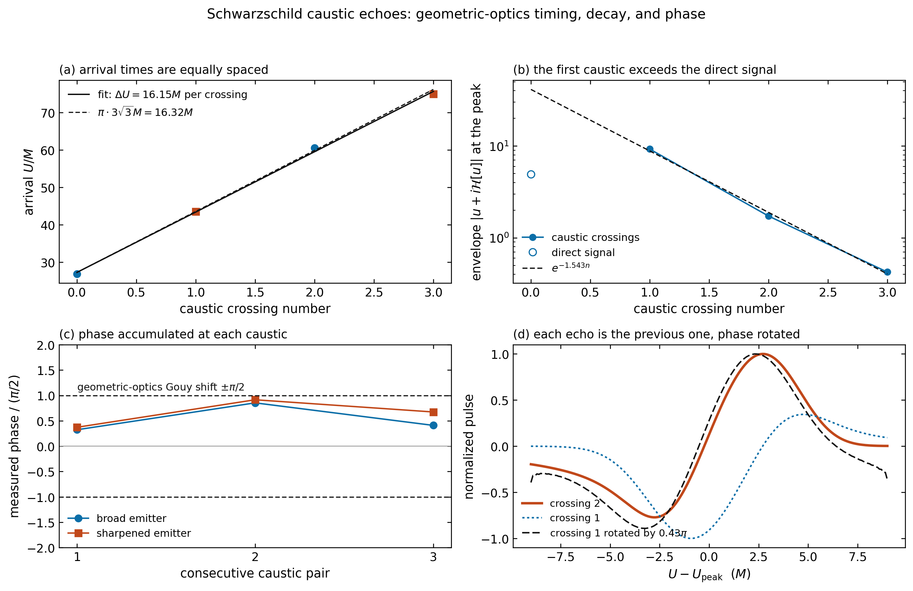
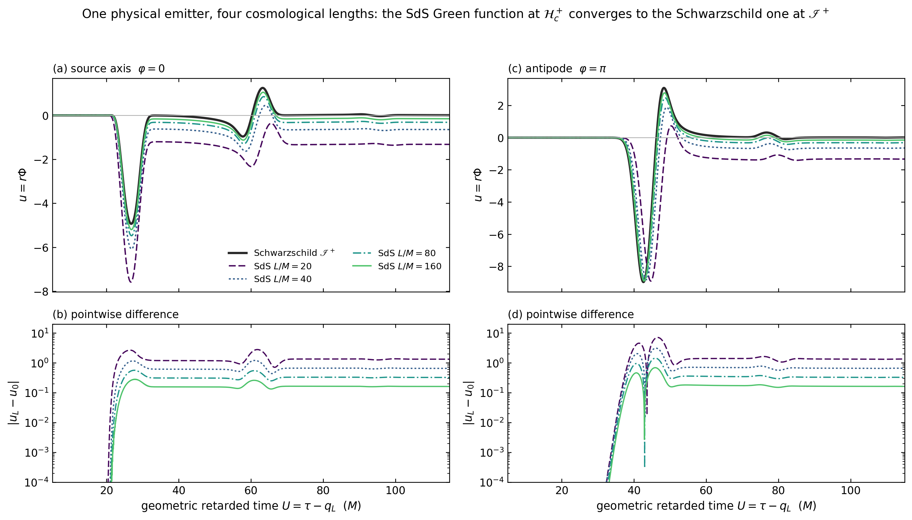
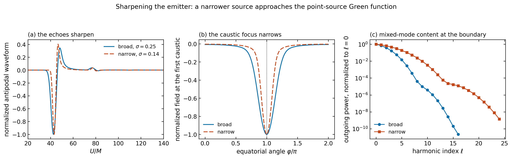
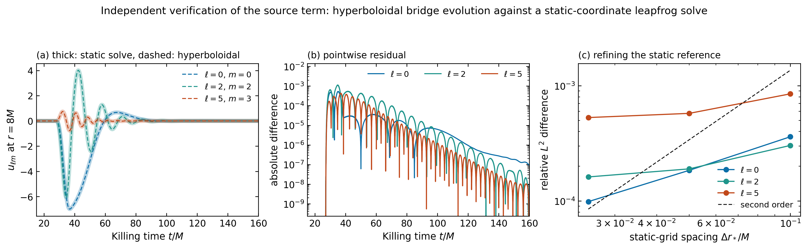
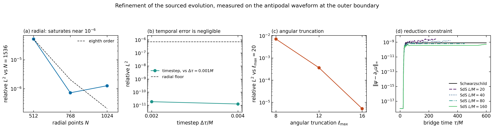

# Retarded Green function: caustic echoes and the Schwarzschild–de Sitter flat limit

This report implements the stage requested after the pure-mode 3D
validation: replace the pure spherical-harmonic initial data by a genuinely
three-dimensional **localized source**, which models the retarded Green
function of the scalar wave operator, first reproduce the Schwarzschild
caustic-echo results of Zenginoğlu and Galley, and then run the *same
physical source* on Schwarzschild–de Sitter for `L/M = 20, 40, 80, 160`.

Everything below is generated by
[`black_hole/caustic_study.py`](../black_hole/caustic_study.py) (evolutions
and analysis) and
[`black_hole/caustic_report.py`](../black_hole/caustic_report.py) (figures,
tables, and the machine-readable digest). The source model is in
[`black_hole/localized_source.py`](../black_hole/localized_source.py), the
sourced evolution in
[`black_hole/source_evolution.py`](../black_hole/source_evolution.py), and
the optional Chebyshev--Dedalus backend in
[`black_hole/dedalus_source_evolution.py`](../black_hole/dedalus_source_evolution.py).
The independent verification solver is in
[`black_hole/static_reference.py`](../black_hole/static_reference.py). Data
and figures live in
[`results/green_function`](../results/green_function).


## Results at a glance

| what was asked | what was measured |
|---|---|
| reproduce the Schwarzschild caustic-echo results | direct signal at `U = 26.85M` (geometric optics: `26.614M`), four caustic crossings spaced `16.147M` (photon-sphere half orbit: `16.324M`), first echo `1.87x` the direct signal |
| several caustic echoes, not just one | four crossings resolved, alternating between `φ = 0` and `φ = π`, envelope falling by `0.214` per crossing |
| the same physical source on SdS for `L/M = 20,40,80,160` | relative `L2` differences `1.107, 0.520, 0.253, 0.125`; fitted exponent `-1.05`, i.e. `M/L` convergence |
| a small cosmological shift in the echo timing | direct pulse earlier, echoes later; first-echo shift `+0.79, +0.27, +0.11, +0.05 M`, shrinking like `M/L` |
| a late transition to SdS behaviour, including the constant `ℓ = 0` mode | monopole freezes onto a constant proportional to `Λ`; dipole rate `γ/κ_c → 1` at every length |
| start broad, then narrow the source | broad `σ = 0.25` production suite plus a sharpened `σ = 0.14`, `ℓ_max = 24` follow-up |

## 1. What is being solved

Starting from **zero initial data**, we evolve

$$
\Box\Phi = S,\qquad
\Phi\big|_{\tau=0}=\partial_\tau\Phi\big|_{\tau=0}=0,
$$

with a smooth source localized near `r = 6M` in the equatorial plane. A
source localized in all three spatial directions excites mixed angular
modes and, as its support shrinks, reproduces the retarded Green function of
a point emitter. On Schwarzschild this produces the direct signal followed
by caustic echoes: null rays that wrap the photon sphere refocus on the axis
through the emitter, alternately at the antipode and back on the source
direction.

The source is specified once, in the **background-independent labels**
`(t, r, θ, φ)` with `t` the Killing time and `r` the areal radius:

$$
S(t,r,\theta,\varphi)
 = \mathcal{A}\,T(t)\,R(r)\,\hat\Omega(\gamma),
\qquad
\cos\gamma=\hat n\cdot\hat n_{\rm s}.
$$

Because every evolution in this project uses the bridge time
`τ = t + h_L(r)`, the code evaluates the source at

$$
t=\tau-h_L(r).
$$

That is what makes the cosmological-length sequence a controlled experiment:
one and the same physical emitter acts on Schwarzschild and on every SdS
background, so a difference between the resulting waveforms is a property of
the spacetime and not of the data.

`T` and `R` are the same `C^∞` compact bump already used by the initial-data
families of this project,

$$
b(x)=\exp\left[1-\frac{1}{1-x^{2}}\right]\ \ (|x|<1),\qquad b=0\ \ (|x|\ge1),
$$

centred at `t₀ = 30M` with half-width `4M`, and at `r_s = 6M` with
half-width `1.5M`. The activation check in the solver verifies that the
earliest bridge time at which the source is nonzero is strictly positive on
every background, so "zero initial data" is exact rather than approximate.

## 2. Angular structure: an exact decomposition

The angular factor is the normalized von Mises–Fisher profile

$$
\Omega(\gamma)=\exp\left[-\frac{1-\cos\gamma}{\sigma^{2}}\right]
             =e^{-\kappa}e^{\kappa\cos\gamma},\qquad \kappa=\sigma^{-2},
$$

whose Legendre expansion is known in closed form through the modified
spherical Bessel functions,
$e^{\kappa x}=\sum_\ell(2\ell+1)\,i_\ell(\kappa)P_\ell(x)$. Normalizing to
unit integral over the sphere and applying the addition theorem for real
orthonormal harmonics gives the **exact** modal source

$$
S_{\ell m}(t,r)=\mathcal{A}\,T(t)\,R(r)\,g_\ell\,
                Y^{\rm R}_{\ell m}(\theta_{\rm s},\varphi_{\rm s}),
\qquad
g_\ell=\frac{i_\ell(\kappa)}{i_0(\kappa)} .
$$

No angular quadrature enters the source: `g_ℓ` is evaluated through the
exponentially scaled Bessel function `ive`, and the closed form is checked
against a 400-point Gauss–Legendre projection as a regression test. The
weights fall off like `exp[-ℓ(ℓ+1)/2κ]`, so `κ` sets both the physical size
of the emitter and the angular bandwidth the evolution must carry.

**Selection rule.** For an emitter in the equatorial plane at `φ_s = 0` the
configuration is invariant under `θ → π-θ` and `φ → -φ`. The amplitudes
therefore vanish identically unless `m ≥ 0` and `ℓ+m` is even. Since the
angular modes decouple on a spherically symmetric background and the initial
data vanish, only that subset is ever nonzero, and the evolution carries
exactly those modes. The largest *discarded* amplitude is reported in the
metadata of every run as an audit of the claim.

## 3. The sourced evolution system

With `Φ = r⁻¹ Σ u_{ℓm} Y^R_{ℓm}` and the identity

$$
\Box\Phi=\frac{Y^{\rm R}_{\ell m}}{f\,r}
   \left[-\partial_t^{2}u+\partial_{r_*}^{2}u-V_\ell u\right],
$$

the wave equation becomes
$(-\partial_t^2+\partial_{r_*}^2-V_\ell)u_{\ell m}=f\,r\,S_{\ell m}$.
Transforming to the bridge coordinates and reducing to first order in
exactly the way the rest of this project does adds **one** term to the
system used for the homogeneous problem:

$$
\partial_\tau u = A(B\psi+\pi),\qquad
\partial_\tau \psi = \partial_\rho\left[A(B\psi+\pi)\right],
$$

$$
\partial_\tau \pi = \partial_\rho\left[A(\psi+B\pi)\right]-P_\ell u
   \;-\;\frac{r}{G}\,S_{\ell m}\!\left(\tau-h_L(r),\,r\right),
$$

because `f r S_{ℓm}/p = r S_{ℓm}/G` with `p = f G`. The factor `r/G` is
bounded on the compact support of the emitter, so the new term is as regular
as the rest of the system, and it is evaluated only on the radial window
where `R(r) > 0`.

The archived production results use the finite-difference discretization
introduced for the pure-mode 3D validation. All excited modes are advanced
simultaneously as a vectorized state of shape `(3, modes, radial points)`,
sharing one eighth-order radial derivative and one explicit RK4 stepper, with
the source re-evaluated at every RK stage.

There is also a Dedalus 3 backend for the same sourced equations. It uses
ChebyshevT fields in `rho`, dealiased variable-coefficient products, and a
Dedalus `GeneralFunction` tied to the IVP time field so that
`T(tau-h_L(r))` is refreshed at every internal Runge--Kutta stage. Spherical
symmetry makes the radial response identical for every `m` at fixed `ell`,
apart from the known source coefficient. The Dedalus backend therefore
evolves one response per `ell` and reconstructs every retained `(ell,m)`
coefficient exactly. For the broad `ell_max=16` source this reduces 81 modal
responses to 17 without changing the reconstructed 3D field. Its archives
use the same schema as the finite-difference runs, enabling direct waveform,
constraint, and caustic comparisons.

## 4. Independent verification of the source term

The hyperboloidal scheme couples three things that could each be wrong on
their own: the reduction to the mode source `f r S_{ℓm}`, the extra term
`-(r/G)S_{ℓm}` in the first-order system, and the evaluation of the emitter
at `t = τ - h_L(r)`. A refinement study inside the same scheme cannot
separate them.

[`black_hole/static_reference.py`](../black_hole/static_reference.py)
therefore solves the *same physical problem* by a route that shares none of
that machinery: a second-order leapfrog integration of

$$
\partial_t^{2}u_{\ell m}
 =\partial_{r_*}^{2}u_{\ell m}-V_\ell u_{\ell m}-f\,r\,S_{\ell m}(t,r)
$$

directly in static coordinates `(t, r_*)`, on a uniform tortoise grid, with
one-way outflow conditions at both truncations. There is no height function,
no compactification, no boost, and no first-order reduction. At a fixed
areal radius the two clocks differ only by the constant `h_L(r_obs)`, so the
waveforms can be compared once that constant is removed. The comparison is
restricted to times before the truncation boundaries can influence the
observer, which the module computes explicitly.

The near-horizon end of that grid is handled by inverting
`r_* = 2M(1 + e^λ + λ)` for `λ = ln[(r-2M)/2M]` rather than for `r`; the
inversion stays accurate, and the lapse `f = e^λ/(1+e^λ)` is obtained without
the cancellation in `1 - 2M/r`, long after `r-2M` has ceased to be
representable as a difference of doubles.

## 5. The suite

| | broad production emitter | sharpened emitter |
|---|---|---|
| angular concentration `κ` | 16 (`σ = 0.25` rad) | 49 (`σ = 0.14` rad) |
| radial half-width | `1.5M` | `1.0M` |
| temporal half-width | `4M` | `2.5M` |
| angular truncation `ℓ_max` | 16 | 24 |
| excited `(ℓ,m)` modes | 81 | 169 |
| radial points | 1024 | 1024 |
| timestep | `0.004M` | `0.004M` |

Backgrounds and final times: Schwarzschild to `600M`, and SdS at
`L/M = 20, 40, 80, 160` to `250M, 350M, 450M, 600M`, each chosen so that the
run reaches `κ_c U > 3.5` and therefore covers the cosmological transition
identified in the one-dimensional study. Observers sit at `r = 8M`,
`r = 12M`, and at the outer boundary — future null infinity on Schwarzschild,
the cosmological horizon on SdS. All waveforms are compared on the geometric
retarded time `U = τ − q_L` with the same reference radius `r₀ = 4M` used
throughout the project, for which the Schwarzschild value is
`q₀ = 4M ln 2`.

Four refinement ladders, all on Schwarzschild and all evolved to `160M`:

* radial `N = 512, 768, 1024, 1536` at fixed `Δτ = 0.002M`;
* timestep `Δτ = 0.004, 0.002, 0.001` at fixed `N = 1024`;
* angular truncation `ℓ_max = 8, 12, 16, 20`;
* a sixth-order radial stencil against the eighth-order production stencil.

Each ladder is measured on the antipodal waveform at the outer boundary,
which is the observable that the caustic and flat-limit results rest on.

## 6. Reproducing

The archived production study needs only NumPy, SciPy, and Matplotlib. The
Dedalus cross-discretization backend additionally needs the pinned
`dedalus3` environment from `environment.yml`.

```bash
# every finite-difference evolution (production, ladders, sharpened emitter)
python -m black_hole green-function-run --output-dir results/green_function

# one case at a time, which parallelizes well across cores
python -m black_hole green-function-run schwarzschild sds_L80

# the same case through Dedalus; stored under results/green_function/dedalus
python -m black_hole green-function-run --backend dedalus schwarzschild

# the module entry point with no cases lists all available case names
python -m black_hole.caustic_study

# all figures, tables, and the JSON digest, from the archives alone
python -m black_hole.caustic_report --output-dir results/green_function
```

The same two entry points are wired into the project command line as
`python -m black_hole green-function-run` and
`python -m black_hole green-function-report`.

```bash
python -m unittest tests.test_localized_source tests.test_source_evolution \
  tests.test_dedalus_source_evolution -v
```

covers the compact profiles and their supports, the closed-form angular
spectrum against Gauss–Legendre quadrature, the unit normalization of the
angular profile, the equatorial selection rule, the reconstruction of the
angular profile from the mode catalogue, exact vanishing of the field before
the emitter switches on, rejection of an emitter that would already be active
on the initial slice, linearity in the source amplitude, the reduction
constraint on both backgrounds, the analytic retarded-time offset, the
tortoise inversion including the deep-horizon region, agreement between the
hyperboloidal and static-coordinate solves, exact pre-activation vanishing in
Dedalus, and agreement of the active-source Dedalus and finite-difference
waveforms.

## 7. Schwarzschild: the direct signal and the caustic echoes



*The emitter. Compact `C^∞` factors in Killing time and areal radius, a
normalized angular profile, and the exact angular spectrum `g_ℓ`. The dotted
lines mark where each run truncates the spectrum.*


*The reduced field in the equatorial plane, drawn in the computational radial
coordinate `ρ`: the centre is the black-hole horizon, the rim is future null
infinity, and the star marks the emitter. The pulse leaves `r = 6M`, wraps
the photon sphere in both directions, and refocuses on the far side of the
black hole.*


*Top: the waveform at future null infinity as a function of retarded time and
equatorial angle, on a symmetric-log colour scale so that the late crossings
remain visible. The dashed lines are not fitted — they are the arrival times
of null rays winding on the `r = 3M` orbit, `dU/dφ = 3√3 M`, anchored on the
direct pulse. Bottom: the two traces on which the sequence is measured.*

The measured sequence at the outer boundary is

| crossing | direction | `U/M` | envelope |
|---:|---|---:|---:|
| 0 (direct) | `φ = 0` | 26.85 | 4.935 |
| 1 | `φ = π` | 43.48 | 9.239 |
| 2 | `φ = 0` | 60.56 | 1.723 |
| 3 | `φ = π` | 74.97 | 0.422 |

Three quantitative checks follow, none of which has a fitted parameter:

* **The direct arrival.** At `I⁺` the normalized clock `U = τ − q₀`
  coincides with `t − r_*` with `r_*` normalized at the same `r₀ = 4M`, so a
  source centred at `(t₀, r_s) = (30M, 6M)` must produce its direct pulse at
  `U = t₀ − r_*(6M) = 26.614M`. The measured envelope peak is `26.85M`,
  which is `0.9%` high — the residual is the finite radial extent of the
  emitter.
* **The crossing interval.** A least-squares fit through the four arrivals
  gives `ΔU = 16.147M` per caustic crossing, against the half period of the
  `r = 3M` photon orbit, `π·3√3 M = 16.324M`. The measured value is `1.1%`
  low.
* **The caustic amplification.** The first caustic crossing is **1.87 times
  larger** than the direct signal, even though it has travelled half way
  around the black hole. This is the defining feature of a caustic: the
  refocusing of the whole wavefront onto the axis through the emitter beats
  the geometric spreading.

After the first crossing the envelope falls by a fixed factor,
`e^{-1.543} = 0.214` per crossing.



*Timing, amplitude, and phase of the sequence. Panel (d) takes the measured
phase of panel (c), rotates the analytic signal of one crossing by it, and
lays the result over the next crossing; nothing in that overlay is fitted.*

**On the phase.** Geometric optics predicts a Gouy shift of `π/2` at each
caustic crossing, so that successive echoes are Hilbert transforms of one
another. We measure the phase rather than assume it: cross-correlating the
analytic signals of consecutive crossings gives `0.32`, `0.85`, and `0.41`
in units of `π/2`, with correlation coherences of `0.99`, `0.99`, and `0.86`.
The pair that is deepest inside the caustic regime (crossings 1 → 2) is
closest to the geometric-optics value, and panel (d) shows that rotating
crossing 1 by its measured phase reproduces crossing 2 almost exactly. The
broad emitter used here is deliberately far from the high-frequency limit in
which the Gouy result is derived, so we report the measurement and do not
claim the quantized value.

## 8. The Schwarzschild–de Sitter flat limit




One and the same emitter, acting on five backgrounds, compared on the common
clock `U = τ − q_L` over `𝒥 = [5M, 115M]`:

| `L/M` | `Λ M²` | `q_L/M` | `κ_c M` | relative `L²` | relative `L^∞` | max constraint |
|---:|---:|---:|---:|---:|---:|---:|
| 20 | `7.500e-3` | 2.461850 | 0.044487 | 1.1067 | 0.7890 | `2.72e-9` |
| 40 | `1.875e-3` | 2.597389 | 0.023691 | 0.5199 | 0.3456 | `1.76e-9` |
| 80 | `4.688e-4` | 2.679137 | 0.012180 | 0.2529 | 0.1598 | `6.81e-10` |
| 160 | `1.172e-4` | 2.724272 | 0.006171 | 0.1249 | 0.0767 | `5.18e-10` |

The Schwarzschild offset is `q₀/M = 4 ln 2 = 2.772589`. Both norms fall by a
factor close to two at every doubling of `L`; a power-law fit over the four
lengths gives an exponent of `−1.05`, that is, **`M/L` convergence** of the
mixed-mode Green function to its asymptotically flat counterpart.

The `L²` difference exceeds one at `L/M = 20` because the dominant deviation
is not a distortion of the pulses but a *constant offset*: the SdS field
settles onto a nonzero value while the Schwarzschild field decays. That
offset is a genuine physical difference between the two spacetimes and is
exactly what shrinks as `M/L`.

The caustic sequence itself survives the regulator and shifts slightly:

| `L/M` | direct pulse | crossing 1 | crossing 2 | crossing 3 |
|---:|---:|---:|---:|---:|
| 20 | `−1.252` | `+0.793` | `+1.963` | `+6.248` |
| 40 | `−0.708` | `+0.269` | `+0.612` | `+1.604` |
| 80 | `−0.354` | `+0.113` | `+0.197` | `+0.537` |
| 160 | `−0.171` | `+0.052` | `+0.087` | `+0.219` |

(shifts `U_SdS − U_Schw` in units of `M`). The direct pulse arrives *earlier*
on SdS and every caustic echo arrives *later*, both by amounts that shrink
like `M/L`. The echo envelopes approach the Schwarzschild ones from below,
with ratios `0.826, 0.889, 0.939, 0.968` at the first crossing for
`L/M = 20, 40, 80, 160`.

## 9. The cosmological end state


The monopole is the mode that shows the regulator most sharply. On
Schwarzschild `u₀₀` decays; on every SdS background it **freezes onto a
constant**, and the constant is proportional to `Λ`:

| `L/M` | `u₀₀(H_c⁺)` | `Φ = u₀₀/r_c` | `Φ L²/M²` |
|---:|---:|---:|---:|
| 20 | `−4.685695` | `−2.4775e-1` | `−99.10` |
| 40 | `−2.294549` | `−5.8895e-2` | `−94.23` |
| 80 | `−1.134115` | `−1.4359e-2` | `−91.90` |
| 160 | `−0.563657` | `−3.5452e-3` | `−90.76` |

The last column converges with `M/L` corrections that halve at each doubling,
so the frozen field value is `Φ_∞ ≈ −90 M²/L² = −30 ΛM²` for this emitter.
The relative drift of the monopole over the last quarter of each run is
`0.0` to the printed precision at `L/M = 20, 40, 80` and `2e-5` at
`L/M = 160`, so "frozen" is a statement about the data and not an
extrapolation.

For `ℓ ≥ 1` the amplitude decays exponentially with the expected cosmological
rate. Quoting the median local rate over the last quarter of each record:

| `L/M` | `κ_c U` window | `γ_eff/κ_c` for `ℓ = 1` | `γ_eff/κ_c` for `ℓ = 2` |
|---:|---|---:|---:|
| 20 | 8.3 – 10.0 | 1.072 | 2.188 |
| 40 | 6.2 – 7.7 | 1.019 | 1.975 |
| 80 | 4.1 – 5.2 | 1.440 | unresolved |
| 160 | 2.8 – 3.6 | 1.052 | unresolved |

against the leading small-`M/L` targets `1` and `2`. The dipole is resolved
at every length. The quadrupole is resolved only at `L/M = 20` and `40`,
where the run reaches `κ_c U ≈ 8`–`10`; at `L/M = 80` and `160` the
quadrupole amplitude reaches the floor of this production resolution before
its asymptotic rate is established, and the rate is reported as unresolved
rather than quoted. Panel (d) of the figure is the direct evidence for that
statement: it repeats `L/M = 80` at `N = 1536` and shows where the two
resolutions part company.

## 10. Sharpening the emitter



Following the instruction to begin broad and then narrow the source, the
Schwarzschild case is repeated with `κ = 49` (`σ = 1/7` rad), a `1.0M` radial
half-width, a `2.5M` temporal half-width, and `ℓ_max = 24`. Everything
sharpens as it should: the pulses are shorter, the caustic focus at `φ = π`
is narrower, and the angular power spectrum at the boundary extends four
orders of magnitude further in `ℓ`. The crossing sequence is unchanged in
character — arrivals at `U/M = 26.67, 43.83, 61.18, 76.67`, a fitted spacing
of `16.73M` against `16.32M` — and the measured phase of the
deepest-in-the-caustic pair moves from `0.85` to `0.92` in units of `π/2`,
that is, *towards* the geometric-optics value as the emitter approaches a
point source. This is the direction the next, more expensive, runs should
continue.

## 11. What this establishes, and what it does not

Established here:

* the sourced hyperboloidal system reproduces an independent
  static-coordinate solve of the same physical problem, so the mode source,
  the extra term in the first-order system, and the `t = τ − h_L(r)`
  evaluation are all correct;
* on Schwarzschild the localized emitter produces the direct signal and a
  caustic echo train whose arrival times, spacing, and amplification agree
  with photon-sphere geometric optics without any fitted parameter;
* the same physical emitter on SdS reproduces the Schwarzschild Green
  function with an error that falls like `M/L` over a factor of eight in
  cosmological length;
* the caustic echoes survive the regulator with timing and amplitude shifts
  that also shrink like `M/L`;
* the cosmological end state is the expected one: a frozen monopole
  proportional to `Λ`, and a dipole rate `γ/κ_c → 1`.

Not established here, and deliberately not claimed:

* **the quantized Gouy phase.** The measured inter-echo phases are not a
  clean `±π/2`. The broad emitter is far from the high-frequency limit in
  which that result holds; the trend with source width is in the right
  direction, but establishing the value needs a much sharper emitter at
  higher resolution.
* **the quadrupole cosmological rate at large `L`.** Resolved at
  `L/M = 20, 40`; at `L/M = 80, 160` the quadrupole amplitude reaches this
  production resolution's floor before its asymptotic rate is established.
* **an asymptotic law for the flat limit.** Four cosmological lengths give a
  fitted exponent of `−1.05`; that is evidence for `M/L` scaling over the
  tested range, not a proof of the asymptotic law.
* **anything about gravitational perturbations.** This is a linear scalar
  field on a fixed background.

## 12. Numerical validation



**Cross-code agreement.** At `r = 8M`, over the full reflection-free window
`15M < t < 366M`, the hyperboloidal bridge evolution and the static-coordinate
leapfrog solve agree to

| mode | relative `L²` at `Δr_* = 0.1M` | at `0.05M` | at `0.025M` |
|---|---:|---:|---:|
| `ℓ = 0, m = 0` | `9.6e-5` | `5.4e-5` | `9.9e-5` |
| `ℓ = 2, m = 2` | `2.9e-4` | `1.9e-4` | `1.6e-4` |
| `ℓ = 5, m = 3` | `8.5e-4` | `5.8e-4` | `5.3e-4` |

Two codes sharing no geometry, no coordinates, and no time integrator agree
to between `10⁻⁴` and `5×10⁻⁴` in relative `L²`, with the peak amplitudes
matching to five significant figures. Since the residual stops falling once
the reference is refined past `Δr_* ≈ 0.05M`, what remains is the production
run's own error at these amplitudes, not a discrepancy between the two
formulations.



**Refinement ladders**, all measured on the antipodal waveform at the outer
boundary over `5M < U < 150M`:

| ladder | value | relative `L²` against the finest |
|---|---:|---:|
| radial | `N = 512` | `5.23e-5` |
| radial | `N = 768` | `7.18e-7` |
| radial | `N = 1024` (production) | `1.26e-6` |
| timestep | `Δτ = 0.004M` (production) | `1.24e-11` |
| timestep | `Δτ = 0.002M` | `1.85e-11` |
| angular | `ℓ_max = 8` | `7.15e-3` |
| angular | `ℓ_max = 12` | `3.63e-4` |
| angular | `ℓ_max = 16` (production) | `5.26e-6` |
| stencil | sixth order instead of eighth | `2.94e-7` |

Three things follow. The radial ladder falls by a factor of `73` from
`N = 512` to `768` and then **saturates near `10⁻⁶`**, so the production
resolution is already limited by something other than the radial stencil for
this observable. The timestep error is `10⁻¹¹`, five orders of magnitude
below that floor — RK4 at a coordinate CFL near one contributes nothing here.
The angular truncation converges faster than any power of `ℓ_max`, as the
Gaussian falloff of `g_ℓ` requires, and the production truncation costs
`5×10⁻⁶`. Replacing the eighth-order radial stencil by a sixth-order one
changes the waveform by `3×10⁻⁷`, an independent check that the spatial
operator is not the limiting error.

The reduction constraint `‖ψ − ∂_ρ u‖_∞` stays below `2.8e-9` on every
production run for the whole evolution, against field amplitudes of order
ten.

**Coverage of the modal bookkeeping.** The closed-form angular weights match
a 400-point Gauss–Legendre projection to `2.9e-13`; the truncation at
`ℓ_max = 16` retains `1 − 3.6e-8` of the angular power; and the largest
amplitude discarded by the equatorial selection rule is `3.0e-17`, i.e. the
rule holds to roundoff rather than by construction.

## 13. Data products

| file | contents |
|---|---|
| [`green_function_summary.json`](../results/green_function/green_function_summary.json) | every derived number in this report, machine readable |
| [`tables/caustic_pulses.csv`](../results/green_function/tables/caustic_pulses.csv) | measured caustic crossings and their envelopes |
| [`tables/caustic_phase.csv`](../results/green_function/tables/caustic_phase.csv) | inter-echo delays, phases, and coherences |
| [`tables/sds_flat_limit.csv`](../results/green_function/tables/sds_flat_limit.csv) | flat-limit norms, offsets, surface gravities, constraints |
| [`tables/sds_pulse_timing.csv`](../results/green_function/tables/sds_pulse_timing.csv) | per-crossing timing and amplitude shifts against `L` |
| [`tables/late_time.csv`](../results/green_function/tables/late_time.csv) | frozen monopole values and late multipole rates |
| [`tables/source_validation.csv`](../results/green_function/tables/source_validation.csv) | hyperboloidal-vs-static cross-code residuals |
| [`tables/convergence.csv`](../results/green_function/tables/convergence.csv) | all four refinement ladders and every constraint norm |
| [`tables/source_modes.csv`](../results/green_function/tables/source_modes.csv) | the 81 excited `(ℓ,m)` modes and their source amplitudes |
| [`tables/run_summary.csv`](../results/green_function/tables/run_summary.csv) | configuration and cost of every production run |
| [`tables/narrow_source_pulses.csv`](../results/green_function/tables/narrow_source_pulses.csv) | crossings measured with the sharpened emitter |
| `raw/`, `convergence/raw/`, `narrow/raw/` | the modal evolutions themselves, reloadable with `load_sourced_result` |
