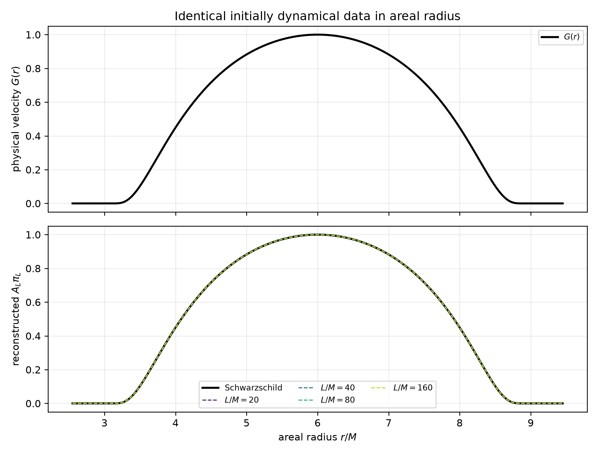
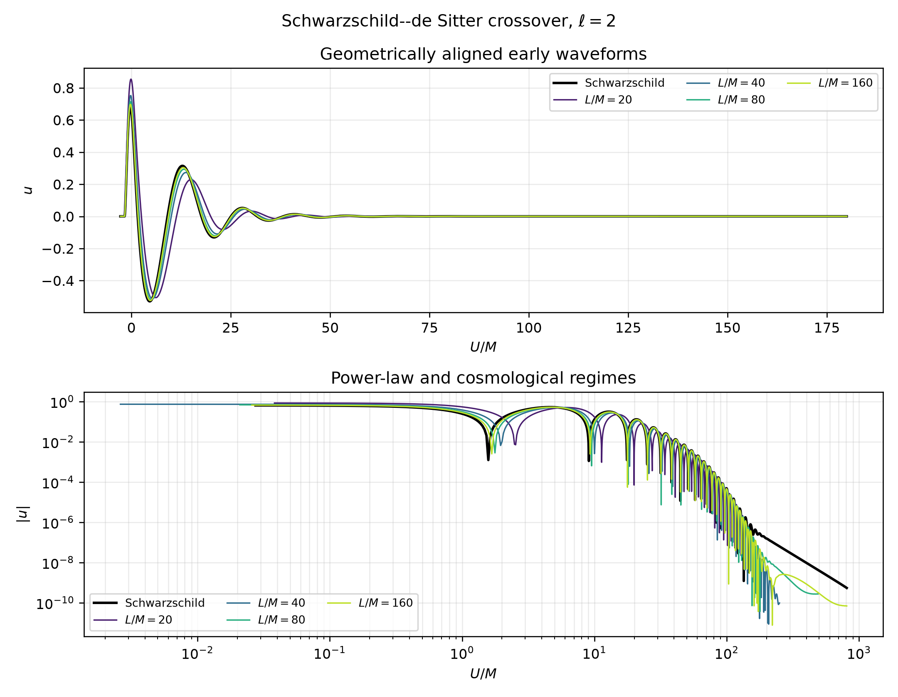

# Dynamical scalar tails and the Schwarzschild--de Sitter crossover

This study is the final one-dimensional validation step before the planned
three-dimensional implementation.  It follows the calculation requested by
Professor Anil Zenginoglu and the physical picture developed by Brady,
Chambers, Laarakkers, and Poisson in
[Radiative falloff in Schwarzschild-de Sitter spacetime](../9902010v2.pdf)
([arXiv:gr-qc/9902010](https://arxiv.org/abs/gr-qc/9902010)).

The calculation separates three questions:

1. Does the independent Schwarzschild solver recover Price's law for generic
   initially dynamical data?
2. Does a finite-\(L\) SdS signal pass from Schwarzschild-like behavior to a
   cosmological tail?
3. For how long is a finite-\(L\) waveform a useful approximation to the
   asymptotically flat waveform?

## 1. Physical initial data

The reduced scalar field is \(u=r\Phi\).  On the initial bridge slice,

\[
u(0,r)=0,\qquad \psi(0,r)=0,\qquad
\partial_tu(0,r)=\partial_\tau u(0,r)=G(r).
\]

The default \(G\) is the normalized \(C^\infty\) bump

\[
G(r)=
\begin{cases}
\exp\!\left(1-\dfrac{1}{1-x^2}\right),&|x|<1,\\
0,&|x|\ge1,
\end{cases}
\qquad x=\frac{r-6M}{3M}.
\]

Thus the support is \(3M<r<9M\), strictly away from both computational
boundaries.  The first-order equation is

\[
\partial_\tau u=A(B\psi+\pi).
\]

Consequently, the momentum is initialized separately on each background as

\[
\pi_L=\frac{G(r)}{A_L},\qquad \pi_0=\frac{G(r)}{A_0}.
\]

Assigning the same array directly to \(\pi\) would produce different physical
velocities.  Unit tests reconstruct \(A_L\pi_L\) and verify pointwise equality
with the common \(G(r)\), including exact zero support at both boundaries.



## 2. Geometric time and expected rates

The height and tortoise coordinates retain the corrected flat-limit
normalization

\[
h(4M)=r_*(4M)=0.
\]

The analytic endpoint offset is

\[
q_L=\lim_{r\to r_c}(h_L+r_{*,L}),
\]

with the Schwarzschild limit taken at future null infinity.  All outer
waveforms use

\[
U=\tau-q_L.
\]

No fitted translation, cross-correlation shift, or endpoint extrapolation is
used.

For generic compact initially dynamical data, the expected Schwarzschild
decay powers are

\[
u|_{\mathscr I^+}\sim U^{-(\ell+2)},\qquad
u|_{\mathcal H^+}\sim v^{-(2\ell+3)}.
\]

For minimally coupled SdS,

\[
u_{\ell>0}\sim e^{-\gamma U},\qquad
\frac{\gamma}{\kappa_c}\longrightarrow\ell,
\]

up to finite black-hole/cosmological-scale corrections.  The \(\ell=0\) mode
is exceptional and approaches a nonzero constant on every finite-\(L\)
background.

## 3. Numerical method and resolution requirement

The evolution uses the minimal gauge, Chebyshev collocation, analytically
regularized endpoint coefficients, and RK222.  Production signal sampling is
\(\Delta U=0.05M\).  Each finite-\(L\) case is evolved for at least five
cosmological timescales \(\kappa_c^{-1}\); selected checks extend to six or
eight timescales.

Tail calculations demand substantially more resolution than transient
flat-limit comparisons.  A dedicated refinement study found:

- \(N=256\): accurate transients but contaminated late tails;
- \(N=512\): improved late signals but unresolved \(\ell=1\) SdS rate;
- \(N=1024\): resolved \(\ell=0,1\) tails;
- \(N=2048\): required for the \(\ell=2\) tail.

The final raw data therefore use \(N=1024,\Delta\tau=0.005M\) for
\(\ell=0,1\), and \(N=2048,\Delta\tau=0.0025M\) for \(\ell=2\).
Every archive records its actual settings.

## 4. Schwarzschild Price-law validation

The local power index is

\[
p_{\rm eff}(U)=-\frac{d\ln|u|}{d\ln U}.
\]

Fit windows are selected by stability of the two half-window estimates, not
by forcing a target exponent.

| \(\ell\) | Location | Expected | Measured | \(R^2\) | Status |
|---:|---|---:|---:|---:|---|
| 0 | \(\mathscr I^+\) | 2 | 2.0251 | 0.999994 | validated |
| 0 | \(\mathcal H^+\) | 3 | 3.1056 | 0.999919 | validated |
| 1 | \(\mathscr I^+\) | 3 | 2.9842 | 0.999377 | validated |
| 1 | \(\mathcal H^+\) | 5 | -- | -- | unresolved |
| 2 | \(\mathscr I^+\) | 4 | 4.0293 | 0.999791 | validated |
| 2 | \(\mathcal H^+\) | 7 | -- | -- | unresolved |

The higher-multipole horizon signals reach their spatial truncation floors
before clean \(v^{-5}\) and \(v^{-7}\) plateaus form.  They are deliberately
reported as unresolved, consistent with the request to check the horizon only
if practical.

Representative plots are stored in
[`results/sds_scalar/tails/ell0`](../results/sds_scalar/tails/ell0),
[`ell1`](../results/sds_scalar/tails/ell1), and
[`ell2`](../results/sds_scalar/tails/ell2).

## 5. SdS monopole constants

For \(\ell=0\), each finite-\(L\) signal settles to a nonzero value:

| \(L/M\) | Late constant | Relative half-window drift |
|---:|---:|---:|
| 20 | 0.768259 | \(7.20\times10^{-5}\) |
| 40 | 0.357470 | \(8.55\times10^{-6}\) |
| 80 | 0.174514 | \(3.83\times10^{-6}\) |
| 160 | 0.086468 | \(1.83\times10^{-6}\) |

The constant decreases toward zero as the cosmological horizon recedes, while
remaining nonzero for every finite \(L\).  At \(L/M=160\), changing
\(N=512\) to \(1024\) changes the constant from 0.0864490 to 0.0864682; the
relative late-waveform difference is \(1.61\times10^{-4}\).

## 6. Exponential tails for \(\ell>0\)

The local exponential rate is

\[
\gamma_{\rm eff}(U)=-\frac{d\ln|u|}{dU}.
\]

Fits require a positive rate, \(R^2\ge0.98\), and consistent rates in the two
halves of the selected interval.  The raw local indices are singular at
waveform zero crossings; the plotted thick horizontal segments therefore mark
only fit intervals that pass the stated quality criterion.

| \(\ell\) | \(L/M\) | \(\gamma/\kappa_c\) | \(R^2\) | Interpretation |
|---:|---:|---:|---:|---|
| 1 | 20 | -- | -- | no isolated asymptotic interval |
| 1 | 40 | 1.0518 | 0.999737 | resolved exponential |
| 1 | 80 | 1.0445 | 0.999954 | resolved exponential |
| 1 | 160 | 1.0613 | 0.999687 | resolved exponential |
| 2 | 20 | -- | -- | scales not cleanly separated |
| 2 | 40 | -- | -- | scales not cleanly separated |
| 2 | 80 | 1.9249 | 0.998651 | resolved, near target 2 |
| 2 | 160 | 1.7024 | 0.999463 | resolved but pre-asymptotic |

The dipole sequence is consistent with \(\gamma=\kappa_c\) at the
approximately six-percent level.  The quadrupole calculations establish
exponential decay but do not yet demonstrate monotonic convergence of the
fitted rate to \(2\kappa_c\).  The \(L/M=160\) rate remains 15 percent low,
which is recorded as a finite-time/resolution limitation rather than hidden.



### Selected large-\(L\) conditioning test

The converged dipole sequence was extended at fixed \(N=1024\) to \(L/M=320\)
and \(640\), with a Schwarzschild reference evolved to \(3210M\):

| \(L/M\) | Intermediate power | \(R^2\) | 1% trust | 5% trust | 10% trust |
|---:|---:|---:|---:|---:|---:|
| 320 | 4.1583 | 0.9708 | -- | \(79.05M\) | \(83.10M\) |
| 640 | 3.4875 | 0.9905 | \(37.09M\) | \(83.04M\) | \(100.69M\) |

The \(L/M=640\) interval \(109.34M<U<299.59M\) provides the clearest extended
Schwarzschild-like inverse-power regime, although its exponent is still 16
percent above the target \(3\).  Neither large-\(L\) run yields a resolved
late exponential at this resolution: the amplitudes turn into
spatial-truncation plateaus near \(10^{-7}\).  Constraint residuals remain
small (\(4.25\times10^{-10}\) and \(1.51\times10^{-9}\)), so this is a
resolution/conditioning limit rather than an evolution instability.

Accordingly, the calculation stops at \(L/M=640\); extending farther at fixed
\(N\) would not be scientifically justified.  The raw data, combined plots,
and tables are retained in
[`extension_ell1`](../results/sds_scalar/tails/extension_ell1).

## 7. Sliding waveform differences and trust times

On a centered window of width \(20M\), the comparison is

\[
D_L(U)=
\left[
\frac{\int_{\rm window}(u_L-u_0)^2\,dU}
{\int_{\rm window}u_0^2\,dU}
\right]^{1/2}.
\]

A trust time is reported only after the waveform has first remained below the
threshold for \(5M\), and then remained above it for \(5M\).  This prevents
the low-amplitude leading edge from generating a false crossing. `NaN` in
the CSV tables (and `null` in strict JSON) means that a trusted interval below
that threshold was never established; it does **not** mean unlimited
agreement.

Resolved examples include:

| \(\ell\) | \(L/M\) | 5% trust time | 10% trust time |
|---:|---:|---:|---:|
| 1 | 80 | -- | \(36.57M\) |
| 1 | 160 | \(45.98M\) | \(79.18M\) |
| 2 | 160 | -- | \(110.93M\) |

The complete machine-readable table is
[`trust_times.csv`](../results/sds_scalar/tails/trust_times.csv).

## 8. Convergence and profile sensitivity

Resolution evidence is stored in
[`results/sds_scalar/tails/convergence`](../results/sds_scalar/tails/convergence).
For the dipole \(L/M=160\) tail:

| \(N\) | Schwarzschild power | SdS rate | Relative tail error to \(N=1024\) |
|---:|---:|---:|---:|
| 256 | unresolved | unresolved | \(4.36\times10^2\) |
| 512 | 3.6066 | unresolved | \(1.86\times10^1\) |
| 1024 | 3.0027 | 1.0911 | reference |

At fixed \(N=1024\), halving the timestep from \(0.01M\) to \(0.005M\)
changes the fitted \(\gamma/\kappa_c\) by \(8.5\times10^{-8}\), and the
late-waveform relative difference is \(4.77\times10^{-8}\).  Spatial
truncation, not time integration, is the limiting error.

A second physical pulse width was evolved for eight cosmological timescales:

| Support half-width | Schwarzschild power | \(\gamma/\kappa_c\) |
|---:|---:|---:|
| \(2.75M\) | 3.0478 | 0.9146 |
| \(3.00M\) | 3.0027 | 1.0911 |

Both profiles recover the universal Price exponent and bracket the predicted
SdS value \(1\).  Their nine-percent deviations from the target are retained
as a profile/finite-window systematic uncertainty.

## 9. Reproduction

From the supplied `dedalus3` environment:

```bash
python -m black_hole --verbose sds-tail-study \
  --ells 0 1 2 \
  --lengths 20 40 80 160 \
  --center-radius 6 \
  --support-half-width 3 \
  --resolution 1024 \
  --timestep 0.005 \
  --ell2-resolution 2048 \
  --ell2-timestep 0.0025 \
  --signal-dt 0.05 \
  --snapshot-dt 2 \
  --cosmological-timescales 5 \
  --window-width 20 \
  --output-dir results/sds_scalar/tails
```

The command applies the targeted \(N=2048,\Delta\tau=0.0025M\) refinement to
the quadrupole while retaining the \(N=1024\) base settings for the monopole
and dipole. Saved-run comparison commands are available as:

```text
sds-tail-resolution-report
sds-tail-timestep-report
sds-tail-profile-report
```

Principal data products:

- [Schwarzschild Price-law table](../results/sds_scalar/tails/schwarzschild_price_law.csv)
- [SdS tail summary](../results/sds_scalar/tails/sds_tail_summary.csv)
- [Trust-time table](../results/sds_scalar/tails/trust_times.csv)
- [Complete diagnostics](../results/sds_scalar/tails/diagnostics.json)
- [Raw production archives](../results/sds_scalar/tails/raw)
- [Convergence evidence](../results/sds_scalar/tails/convergence)
- [Profile sensitivity](../results/sds_scalar/tails/profile_sensitivity)
