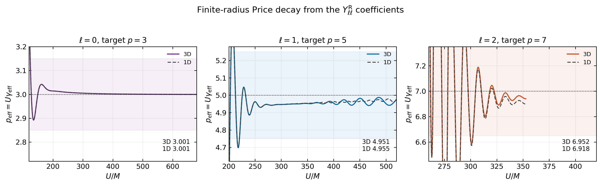
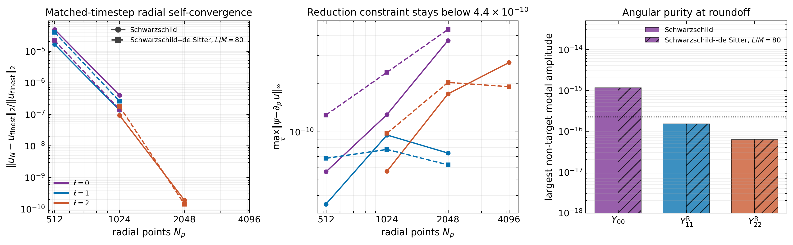
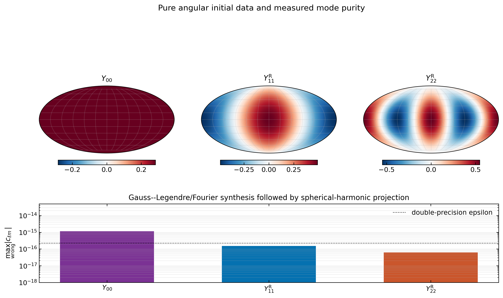

# First 3D validation: pure spherical-harmonic packets

This report implements the next step requested after completion of the
one-dimensional study: evolve pure \(Y_{\ell m}\) packets for
\(\ell=0,1,2\) in a three-dimensional angular representation and compare
their waveforms, decay rates, transition intervals, constraints, convergence,
and angular-mode purity directly with the completed 1D runs.

The tests pass.  Over the full production evolutions, the relative waveform
\(L^2\) differences between the independent 3D and 1D discretizations are
\(2.0\times10^{-6}\) to \(3.4\times10^{-5}\).  The 3D code reproduces the
finite-radius Price indices, the dipole and quadrupole SdS transition
intervals, and the angular projection is pure to roundoff.

Everything in this report is generated by
[`black_hole/three_d_validation.py`](../black_hole/three_d_validation.py).
The 3D evolution itself is implemented in
[`black_hole/three_d_solver.py`](../black_hole/three_d_solver.py), and all
new data are stored in
[`results/three_d_validation`](../results/three_d_validation).

## 1. Formulation

The scalar field is represented in an orthonormal real spherical-harmonic
basis,

\[
u(\tau,\rho,\theta,\phi)
 = \sum_{\ell=0}^{\ell_{\max}}\sum_{m=-\ell}^{\ell}
   u_{\ell m}(\tau,\rho)Y^{\rm R}_{\ell m}(\theta,\phi).
\]

Positive \(m\) labels the cosine harmonic and negative \(m\) the sine
harmonic.  Angular synthesis and projection use a Gauss--Legendre grid in
\(\cos\theta\) and a uniform Fourier grid in \(\phi\).  Because the background
is spherically symmetric,

\[
\Delta_{S^2}Y^{\rm R}_{\ell m}
 =-\ell(\ell+1)Y^{\rm R}_{\ell m},
\]

so the angular operator is diagonal.  The evolved modal equations are

\[
\partial_\tau u_{\ell m}=A(B\psi_{\ell m}+\pi_{\ell m}),
\]

\[
\partial_\tau\psi_{\ell m}
 =\partial_\rho[A(B\psi_{\ell m}+\pi_{\ell m})],
\]

\[
\partial_\tau\pi_{\ell m}
 =\partial_\rho[A(\psi_{\ell m}+B\pi_{\ell m})]
 -P_\ell u_{\ell m}.
\]

This is a genuinely angular-spectral 3D representation, but the pure-mode
stage intentionally exploits the exact modal decoupling.  It does not yet
claim a mixed-mode result.

### Independent radial discretization

The 3D validation code does **not** call the 1D Dedalus solver.  The two
implementations use different numerical methods:

| component | 1D reference | 3D validation |
|---|---|---|
| radial grid | Chebyshev-T collocation | uniform \(\rho\) |
| radial derivative | spectral | eighth-order finite difference |
| endpoint treatment | regular spectral coefficients | matched one-sided eighth-order stencils |
| time stepper | Dedalus RK222 | explicit classical RK4 |
| observer extraction | Dedalus interpolation operator | local degree-eight interpolation |
| angular representation | fixed \(\ell\) reduction | real \(Y_{\ell m}\) basis and angular transforms |

Agreement is therefore a cross-discretization check, not a second plotting
path through the same numerical evolution.

## 2. Initial data and production cases

Every run uses the same physical radial data as the final 1D tail study:

\[
u=\psi=0,\qquad \partial_\tau u=G(r),
\]

where \(G\) is the smooth compact bump centered at \(r=6M\) and supported on
\(3M<r<9M\).  The 3D field is initialized with \(G(r)Y_{\ell\ell}^{\rm R}\)
for \((\ell,m)=(0,0),(1,1),(2,2)\).

Both Schwarzschild and \(L/M=80\) Schwarzschild--de Sitter backgrounds are
evolved:

| \(\ell,m\) | \(N_\rho\) | \(\Delta\tau/M\) | Schwarzschild end | SdS end |
|---:|---:|---:|---:|---:|
| \(0,0\) | 2048 | 0.0025 | \(720M\) | \(410.50M\) |
| \(1,1\) | 2048 | 0.0025 | \(830M\) | \(410.50M\) |
| \(2,2\) | 4096 | 0.00125 | \(440M\) | \(492.59M\) |

The quadrupole uses the finer grid and half timestep required by the earlier
1D tail-resolution study.

## 3. Waveform agreement


The colored 3D modal coefficients lie on top of the gray 1D waveforms over
the prompt response, ringdown, and tail.  The comparison uses \(r=8M\), except
for the finite-\(L\) monopole, whose archived 1D run has an exact
cosmological-horizon observer but not an exact \(r=8M\) observer.

| background | \(\ell,m\) | observer | relative waveform \(L^2\) error | maximum error / reference peak |
|---|---:|---|---:|---:|
| Schwarzschild | \(0,0\) | \(r=8M\) | \(2.01\times10^{-6}\) | \(3.22\times10^{-7}\) |
| Schwarzschild | \(1,1\) | \(r=8M\) | \(1.47\times10^{-5}\) | \(1.49\times10^{-6}\) |
| Schwarzschild | \(2,2\) | \(r=8M\) | \(3.42\times10^{-5}\) | \(2.42\times10^{-6}\) |
| SdS \(L/M=80\) | \(0,0\) | \(\mathcal H_c^+\) | \(3.56\times10^{-6}\) | \(7.56\times10^{-7}\) |
| SdS \(L/M=80\) | \(1,1\) | \(r=8M\) | \(1.09\times10^{-5}\) | \(1.04\times10^{-6}\) |
| SdS \(L/M=80\) | \(2,2\) | \(r=8M\) | \(2.64\times10^{-5}\) | \(1.82\times10^{-6}\) |

Machine-readable values are in
[`waveform_agreement.csv`](../results/three_d_validation/waveform_agreement.csv).

## 4. Schwarzschild decay rates



At fixed radius the scalar Price target is \(p=2\ell+3\), where
\(p_{\rm eff}=U\gamma_{\rm eff}\).  The 3D values reproduce both the expected
indices and the 1D measurements:

| \(\ell\) | target | 3D median | 1D median |
|---:|---:|---:|---:|
| 0 | 3 | 3.0006 | 3.0006 |
| 1 | 5 | 4.9506 | 4.9553 |
| 2 | 7 | 6.9518 | 6.9185 |

The plotting ranges stop before the numerical-amplitude floor; no oscillatory
floor-limited samples are presented as resolved tail data.

## 5. SdS transition intervals

The final 1D transition definition is reused without modification.  At
\(r=8M\), a transition is bracketed by persistent departure from an
independently evolved Schwarzschild reference and persistent entry into a
tolerance of the SdS target \(\gamma_{\rm eff}/\kappa_c=\ell\).  The interval
is recomputed over the same 54 combinations of RMS width, smoothing width,
persistence, and tolerance.


| \(\ell\) | code | status | resolved settings | \(\kappa_cU_{\rm dep}\) | \(\kappa_cU_{\rm ent}\) | late rate |
|---:|---|---|---:|---:|---:|---:|
| 1 | 3D | resolved | 54/54 | 1.412 [1.151, 1.760] | 2.833 [2.564, 3.059] | 1.0238 |
| 1 | 1D | resolved | 54/54 | 1.412 [1.151, 1.760] | 2.835 [2.564, 3.066] | 1.0237 |
| 2 | 3D | marginal | 16/54 | 2.702 [2.386, 2.874] | 3.554 [3.481, 3.665] | 2.0331 |
| 2 | 1D | marginal | 16/54 | 2.702 [2.386, 2.874] | 3.546 [3.480, 3.665] | 2.0295 |

For the dipole, the 3D and 1D median entry times differ by \(0.002\) in
\(\kappa_cU\), far below the systematic range.  For the quadrupole they differ
by \(0.008\), again far below the systematic range.  The 3D code also
reproduces the 1D classification: the dipole is resolved by every estimator
setting, while the \(r=8M\) quadrupole is marginal because only 16 of 54
settings resolve a persistent entry before the amplitude floor.

No transition time is assigned to \(\ell=0\).  The minimally coupled
monopole approaches a nonzero constant, so the decay-rate transition used for
\(\ell>0\) is undefined.

## 6. Convergence, constraints, and angular purity



Matched-timestep ladders use \(N_\rho=(512,1024,2048)\) for
\(\ell=0,1\), and \(N_\rho=(1024,2048,4096)\) for \(\ell=2\).  All lower
resolutions run through \(180M\).  The difference to the finest 3D run falls
by two to three orders of magnitude under one doubling:

| background | \(\ell\) | coarse error | middle error | effective decrease |
|---|---:|---:|---:|---:|
| Schwarzschild | 0 | \(4.84\times10^{-5}\) | \(4.00\times10^{-7}\) | \(2^{6.92}\) |
| Schwarzschild | 1 | \(1.63\times10^{-5}\) | \(1.35\times10^{-7}\) | \(2^{6.91}\) |
| Schwarzschild | 2 | \(9.30\times10^{-8}\) | \(1.90\times10^{-10}\) | \(2^{8.93}\) |
| SdS | 0 | \(2.18\times10^{-5}\) | \(1.42\times10^{-7}\) | \(2^{7.26}\) |
| SdS | 1 | \(3.95\times10^{-5}\) | \(2.59\times10^{-7}\) | \(2^{7.26}\) |
| SdS | 2 | \(1.77\times10^{-7}\) | \(1.43\times10^{-10}\) | \(2^{10.28}\) |

These finite-range effective decreases are consistent with a high-order
method; they are not presented as fitted universal convergence orders.

Across all production runs,

\[
\max_\tau\|\psi-\partial_\rho u\|_\infty < 4.4\times10^{-10}.
\]



Synthesis followed by angular projection gives largest wrong-mode
coefficients

| target mode | largest off-mode coefficient |
|---|---:|
| \(Y_{00}\) | \(1.15\times10^{-15}\) |
| \(Y_{11}^{\rm R}\) | \(1.50\times10^{-16}\) |
| \(Y_{22}^{\rm R}\) | \(6.20\times10^{-17}\) |

so the measured angular contamination is at roundoff.

## 7. Scope and next step

This closes the pure-mode validation requested before mixed angular data:

- pure \(\ell=0,1,2\) waveforms agree with 1D;
- finite-radius Schwarzschild rates agree;
- dipole and quadrupole transition intervals agree, including their resolved
  versus marginal classifications;
- matched-timestep radial refinement converges;
- the first-order constraint remains small; and
- angular-mode purity is at roundoff.

The next scientific step is angularly mixed initial data.  That extension
should initialize at least two nonzero \(Y_{\ell m}^{\rm R}\) coefficients,
verify that each linear mode reproduces its pure-mode benchmark, and monitor
all unseeded coefficients for contamination.  No mixed-mode claim is made in
this report.

## 8. Reproduction

```bash
# Run six production cases, twelve convergence cases, and all analysis
python -m black_hole.three_d_validation --verbose suite \
  --output-dir results/three_d_validation

# Rebuild figures and tables from the archived evolutions
python -m black_hole.three_d_validation analyze \
  --output-dir results/three_d_validation

# Regression tests, including the angular transforms and short 3D evolution
python -m unittest discover -s tests -v
```

The complete configurations, CFL values, wall times, constraints, angular
diagnostics, references, and derived measurements are in
[`diagnostics.json`](../results/three_d_validation/diagnostics.json).
